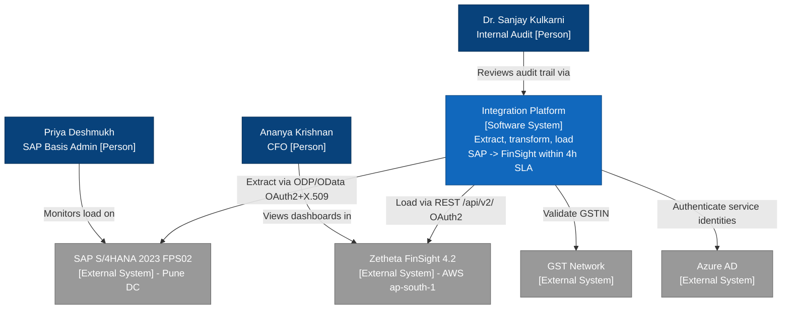
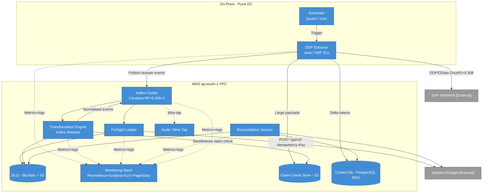
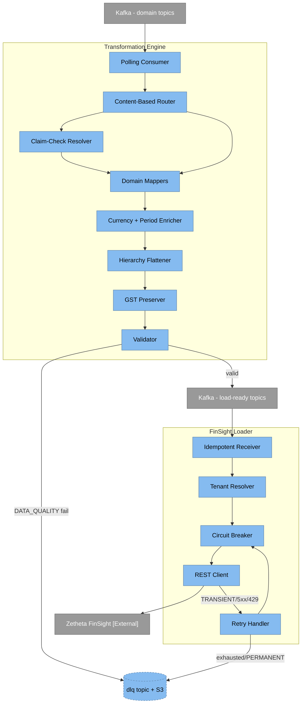

# D1 — Integration Architecture

| | |
|---|---|
| **Project code** | `493560B` |
| **Project** | FDE-9B — Custom API Integration (SAP S/4HANA → Zetheta FinSight) |
| **Client** | Meridian Manufacturing Ltd. |
| **Deliverable** | D1 — Integration Architecture |
| **Document** | `D1_Integration_Architecture_v1.md` |
| **Version** | v1 |
| **Status** | Issued for review |
| **Author** | Forward Deployed Engineering |

---

## 1. Executive Context and Problem Statement

### 1.1 Business context

Meridian Manufacturing Ltd. is a mid-sized Indian manufacturer with **INR 2,400 crore** in annual revenue, operating **7 plants** across three states, organised into **3 SAP company codes**. The finance organisation runs on **SAP S/4HANA 2023 FPS02** (production system **PRD, client 100**) and processes approximately **2.1 million financial transactions per month**. The target analytics platform is **Zetheta FinSight 4.2**, hosted on **AWS Mumbai (`ap-south-1`)**.

Today, financial data reaches FinSight through a nightly batch process that imposes a **24-hour data latency**. Ananya Krishnan (CFO) cannot see current-day cash, cost and margin positions; Fatima Al-Hassan (Manufacturing Operations Director) receives cost-allocation and variance data a full day late; and Dr. Sanjay Kulkarni (Head of Internal Audit) has no continuous lineage from SAP document numbers to the analytics records that drive board reporting.

### 1.2 Problem statement

> Meridian needs continuous, near-real-time financial data flow from SAP S/4HANA to Zetheta FinSight, reducing end-to-end data freshness from **24 hours to under 4 hours** — an **83% improvement** — while respecting SAP performance limits, Indian data-residency regulation, and full audit lineage, across 3 company codes and 7 plants.

### 1.3 Objectives

1. **Latency:** Deliver ≤ 4h data freshness for delta domains (from 24h).
2. **Correctness:** Guarantee reconciliation with zero debit–credit variance per document and a zero-break target across all 10 data domains.
3. **Resilience:** Handle every failure mode gracefully — no silent data loss — with retries, circuit breakers, and a dead-letter path.
4. **Compliance:** Keep 100% of financial-data processing inside AWS `ap-south-1` (RBI data localisation) and preserve GST (CGST/SGST/IGST) breakdown on any amount transform.
5. **Scale:** Design for 10× the current volume and absorb a 5× festival-season spike without data loss or SLA breach.

### 1.4 Scope

**In scope:** extraction from SAP across 12 source endpoints (SRC-001…012), streaming transport, transformation and routing, loading into 12 FinSight destination endpoints (DST-001…012), reconciliation, audit/lineage, and monitoring.

**Out of scope:** changes to SAP business processes, the FinSight analytics layer itself, and the Salesforce/Siemens Opcenter source systems (which remain on their existing feeds).

### 1.5 Routing model (canonical)

| SAP Company Code | Plants | Location | FinSight Tenant |
|---|---|---|---|
| `MC01` | PL01 Pune, PL02 Nashik, PL03 Aurangabad | Maharashtra | `MERIDIAN-MC01` |
| `MC02` | PL04 Ahmedabad, PL05 Rajkot | Gujarat | `MERIDIAN-MC02` |
| `MC03` | PL06 Chennai, PL07 Coimbatore | Tamil Nadu | `MERIDIAN-MC03` |

Company code is the primary routing and Kafka partitioning key throughout the platform.

---

## 2. Solution Overview

The target architecture is an **event-driven streaming pipeline**:

```
SAP S/4HANA → ODP Extractor → Kafka (topics per domain + dlq)
            → Transformation Engine (content-based router)
            → FinSight Loader → Zetheta FinSight
```

Cross-cutting services — **Scheduler**, **Reconciliation Service**, **Monitoring Stack** (Prometheus + Grafana + ELK + PagerDuty), **Audit/Wire-Tap**, and the **DLQ** — surround the core flow.

The design deliberately separates *extraction cadence* (bounded by SAP constraints) from *delivery cadence* (bounded by the FinSight SLA) using Kafka as a durable buffer. This decoupling is what makes the 24h → 4h reduction achievable without overloading SAP: the ODP Extractor pulls deltas at the maximum safe frequency (once per 30 min per provider), and everything downstream runs continuously.

**Data-freshness tiers** (a pragmatic, cost-aware split):

| Tier | Domains | Cadence |
|---|---|---|
| Near-real-time delta | GL, AP, AR, PO, SO | ODP delta every **30 min** |
| Delta (medium) | Material Ledger, Inventory | ODP delta every **60 min** |
| Batch (master) | Cost Centre, Profit Centre | Batch every **4 h** |
| Batch (daily) | Fixed Assets, Budget/Actual | Daily |
| Event | Bank Statements | IDoc (FINSTA) on event |

---

## 3. C4 Level 1 — System Context

The Integration Platform is a single logical system that mediates between SAP S/4HANA (source of record) and Zetheta FinSight (analytics target), with GST Network and Azure AD as supporting external systems, and three key human actors.

Source diagram: [`diagrams/mermaid/DGM_C4_SystemContext.mmd`](../../diagrams/mermaid/DGM_C4_SystemContext.mmd)



**Key relationships**

| From | To | Interaction |
|---|---|---|
| Integration Platform | SAP S/4HANA | ODP/OData reads, OAuth2 + X.509 on SAP Gateway |
| Integration Platform | Zetheta FinSight | REST `POST /api/v2/…`, OAuth 2.0 `client_credentials` |
| Integration Platform | GST Network | GSTIN / tax-breakdown validation |
| Integration Platform | Azure AD | Service-identity authentication |
| CFO / Ops Director | FinSight | Consume dashboards and variance reports |
| Internal Audit | Integration Platform | Consume lineage and reconciliation reports |

---

## 4. C4 Level 2 — Container Diagram

The platform decomposes into containers split across two deployment zones: a thin on-prem footprint in the **Pune data centre** (ODP Extractor + Scheduler, co-located with SAP to minimise RFC latency) and the main processing plane in **AWS `ap-south-1`**.

Source diagram: [`diagrams/mermaid/DGM_C4_Container.mmd`](../../diagrams/mermaid/DGM_C4_Container.mmd)



### 4.1 Container responsibilities

| Container | Technology | Primary responsibilities | Key inputs | Key outputs |
|---|---|---|---|---|
| **ODP Extractor** | Java + SAP JCo, ODP/OData | Delta and batch extraction from SAP; delta-token lifecycle; RFC-pool guard (≤50); enforce batch-window and ≥30-min rules; claim-check offload of large payloads | Scheduler triggers, SAP ODP providers | Domain events to Kafka, tokens to Control DB, payloads to S3 |
| **Kafka** | Apache Kafka (3 brokers, RF=3, ISR=2) | Durable, ordered, partitioned event transport; buffer that decouples extraction cadence from delivery cadence; hosts per-domain topics and the `dlq` topic | Producer writes | Partitioned streams to consumers |
| **Transformation Engine** | Kafka Streams (JVM) | Content-based routing by domain + company code; structural/semantic/aggregation/enrichment/validation/normalisation transforms; currency (TCURR), fiscal-period (V3) and hierarchy (SETNODE/SETLEAF) logic; GST preservation | Domain topics, S3 claim-check, reference data | Load-ready events, DLQ for DATA_QUALITY failures |
| **FinSight Loader** | Java + reactive WebClient | Idempotent delivery to FinSight `/api/v2/`; tenant resolution (MC0x → MERIDIAN-MC0x); circuit breaker; classify + retry; OAuth 2.0 token management | Load-ready events | REST calls to FinSight, DLQ on exhaustion, audit records |
| **Scheduler** | Quartz + cron | Trigger extraction jobs on the correct cadence; enforce SAP batch window (avoid 01:00–04:30 IST) and maintenance windows; sequence master-before-transactional | Schedule config, calendar | Job triggers to Extractor and Reconciliation |
| **Reconciliation Service** | Spring Batch | Compare source vs target on completeness/accuracy/consistency/timeliness; per-document debit=credit; raise breaks and targeted re-loads | Control DB, SAP totals, FinSight totals, Audit store | Recon reports, breaks to DLQ, metrics |
| **Monitoring Stack** | Prometheus, Grafana, ELK, PagerDuty | Metrics, dashboards, structured logs, alerting and on-call routing across all containers | Metrics/logs from all containers | Dashboards, alerts, on-call pages |
| **DLQ** | Kafka `dlq` topic + S3 | Retain unprocessable messages with error code and full context; extended retention; support inspection and reprocessing | Failed messages from Transformation Engine, Loader, Recon | Replayable messages, alerts |
| **Audit / Wire-Tap** | Kafka consumer (wire-tap) + append-only store | Capture immutable lineage (SAP document number → FinSight record) at each stage without affecting the main flow | Wire-tap copies from Kafka, loader confirmations | Lineage records for audit/reconciliation |

Supporting stores: **Control DB** (PostgreSQL on RDS — delta tokens, run state, recon results) and **Claim-Check Store** (S3 — large batch payloads referenced from Kafka).

---

## 5. C4 Level 3 — Component Diagram

The following decomposes the two containers on the critical mapping-and-delivery path — the **Transformation Engine** and the **FinSight Loader** — into internal components.

Source diagram: [`diagrams/mermaid/DGM_C4_Component.mmd`](../../diagrams/mermaid/DGM_C4_Component.mmd)



### 5.1 Component responsibilities

**Transformation Engine**

| Component | Responsibility |
|---|---|
| Polling Consumer | Read domain events from Kafka, manage offsets/commit semantics |
| Content-Based Router | Route by domain and company code (MC01/02/03) to the correct mapper and tenant path |
| Claim-Check Resolver | Fetch large batch payloads from S3 when a message carries a reference |
| Domain Mappers | Field-level transforms for GL/AP/AR/CC/PC/ML/PO/SO/FA/Bank (≥56 mappings; 80+ target) |
| Currency + Period Enricher | Point-in-time FX via TCURR (KURST=`M`, by `GDATU`) to ISO 4217; V3 fiscal period → calendar; special periods 013–016 handling |
| Hierarchy Flattener | Flatten cost-centre / profit-centre hierarchies to Level1–Level7 via SETNODE/SETLEAF |
| GST Preserver | Retain CGST/SGST/IGST components through any invoice-amount transform |
| Validator | Apply data-quality rules and referential-integrity checks; route DATA_QUALITY failures to DLQ |

**FinSight Loader**

| Component | Responsibility |
|---|---|
| Idempotent Receiver | Deduplicate on business key (`documentId`) so at-least-once delivery never double-posts |
| Tenant Resolver | Map company code to FinSight tenant (MC01→MERIDIAN-MC01, etc.) |
| Circuit Breaker | CLOSED / OPEN / HALF-OPEN state machine on the FinSight boundary to prevent cascade failure |
| Retry Handler | Exponential backoff with jitter `wait = min(cap, random(base, base * 2^attempt))`, bounded by a retry budget |
| REST Client | `POST /api/v2/…` with `Idempotency-Key`; OAuth 2.0 `client_credentials` + refresh-token handling |

---

## 6. Data Flow and Sequence Views

### 6.1 Real-time ODP delta flow
Source: [`DGM_DataFlow_ODPDelta.mmd`](../../diagrams/mermaid/DGM_DataFlow_ODPDelta.mmd). The Scheduler fires the ODP Extractor every 30 min (60 min for ML/Inventory); the Extractor requests only the delta since the last token, advances the token **only on success** (no data loss on retry), and publishes company-code-partitioned events onward through transform and load.

### 6.2 Batch extraction flow
Source: [`DGM_DataFlow_Batch.mmd`](../../diagrams/mermaid/DGM_DataFlow_Batch.mmd). Master and totals extracts (Cost/Profit Centre 4h, Fixed Assets/Budget daily) run **outside** the 01:00–04:30 IST batch window, offload large payloads to S3 (claim check), and are loaded master-before-transactional to preserve referential integrity.

### 6.3 Error handling and retry flow
Source: [`DGM_DataFlow_ErrorRetry.mmd`](../../diagrams/mermaid/DGM_DataFlow_ErrorRetry.mmd). Outcomes are classified (TRANSIENT / PERMANENT / DATA_QUALITY / SYSTEM); TRANSIENT errors retry with jittered backoff under a retry budget and circuit-breaker guard; exhausted or permanent failures land in the DLQ with full context and raise a PagerDuty alert.

### 6.4 Reconciliation and audit flow
Source: [`DGM_DataFlow_Reconciliation.mmd`](../../diagrams/mermaid/DGM_DataFlow_Reconciliation.mmd). The Reconciliation Service compares source and target counts and amounts, checks debit=credit per document and referential consistency, and verifies the 4h timeliness SLA — producing a zero-break status or an `ERR-RECON-*` break with targeted remediation.

### 6.5 Sequence diagrams
- **Happy path** end-to-end sync: [`DGM_Seq_HappyPath.mmd`](../../diagrams/mermaid/DGM_Seq_HappyPath.mmd)
- **Error + DLQ** with retry, breaker and idempotent replay: [`DGM_Seq_ErrorDLQ.mmd`](../../diagrams/mermaid/DGM_Seq_ErrorDLQ.mmd)
- **Reconciliation mismatch** resolution: [`DGM_Seq_ReconMismatch.mmd`](../../diagrams/mermaid/DGM_Seq_ReconMismatch.mmd)

---

## 7. Integration Patterns

We apply the Enterprise Integration Patterns (Hohpe & Woolf) canon. Each pattern is mapped to where it is used and why.

| Pattern | Where it applies | Why |
|---|---|---|
| **Message Broker** | Kafka between ODP Extractor and FinSight Loader | Decouples SAP extraction cadence from FinSight delivery cadence; durable buffer absorbs spikes and back-pressure |
| **Content-Based Router** | Transformation Engine router | Different domains (GL vs PO vs SO) and company codes need different mapping logic and tenant targets |
| **Dead Letter Channel (DLQ)** | `dlq` Kafka topic + S3 | Unprocessable messages (after retries, or permanent/DQ failures) are retained for inspection and replay — never dropped |
| **Idempotent Receiver** | FinSight Loader Idempotent Receiver, `Idempotency-Key=documentId` | Kafka at-least-once delivery can redeliver; business-key idempotency prevents duplicate FinSight records |
| **Circuit Breaker** | Loader → FinSight, and Extractor → SAP RFC | Stop hammering a failing dependency; CLOSED/OPEN/HALF-OPEN prevents cascade and protects the RFC pool |
| **Polling Consumer** | ODP Extractor delta polling | SAP ODP does not push; we poll deltas every 30 min (per the ≥30-min constraint) |
| **Claim Check** | Large batch payloads in S3, reference in Kafka | Master/batch extracts can exceed broker message limits; store the payload, pass a lightweight reference |
| **Wire Tap** | Audit/Wire-Tap consumer on Kafka | Copy every message to the lineage/audit store without perturbing the primary flow |

Supporting resilience patterns (detailed in D4): **Bulkhead** (per-domain isolation so a GL failure cannot starve AP), **Timeout** (aggressive per-call timeouts), and **Retry Budget** (global cap to protect a recovering FinSight).

---

## 8. Network Architecture

### 8.1 Topology

```
[SAP S/4HANA — Pune DC (on-prem)]
        |  ODP Extractor + Scheduler (co-located)
        |  OAuth2 + X.509 on SAP Gateway/OData
   [Pune DC edge firewall]
        |
   MPLS + SD-WAN (avg 450 Mbps, shared)  ---- IPsec VPN overlay ----
        |
   [AWS Direct Connect / VPN Gateway — ap-south-1]
        |
   [AWS ap-south-1 VPC]
      - Private subnets: Kafka, Transformation Engine, Loader,
        Reconciliation, Control DB (RDS), S3 endpoints
      - No public ingress to processing tier
        |
   [Zetheta FinSight 4.2 — ap-south-1, private connectivity]
```

### 8.2 Connectivity and controls

| Concern | Design decision |
|---|---|
| Transport | MPLS + SD-WAN Pune DC ↔ AWS `ap-south-1`, with an **IPsec VPN** overlay for encryption in transit; AWS Direct Connect / VPN Gateway terminates in the VPC |
| Extractor placement | ODP Extractor sits **on-prem** next to SAP to keep chatty RFC/ODP traffic local; only compact, batched events traverse the WAN |
| Bandwidth ceiling | Integration is capped at **≤25% of 450 Mbps** during business hours; the Extractor applies package sizing, compression (gzip) and rate shaping; batch/full loads are scheduled off-peak |
| Firewall / ports | Egress from Pune DC to AWS restricted to Kafka TLS (`9093`), HTTPS to FinSight/S3 (`443`), and RDS (`5432`) over the private path; SAP Gateway/OData exposed only to the Extractor host on `44300` (HTTPS) |
| Data residency | **100% of processing in AWS `ap-south-1`** (RBI localisation). No component, log sink, or backup is provisioned outside India. S3, RDS, Kafka, ELK all pinned to `ap-south-1` |
| Identity | Service identities authenticate to Azure AD; SAP side uses OAuth2 + X.509; FinSight uses OAuth 2.0 `client_credentials` |
| Segmentation | Processing tier in private subnets with no public ingress; security groups least-privilege per container; VPC endpoints for S3 to avoid public transit |

### 8.3 Bandwidth budget (illustrative)

At ~2.1M txns/month, delta volumes per 30-min cycle are modest. Assuming ~1 KB compressed per event and business-hour concentration, sustained integration throughput stays comfortably under the 112.5 Mbps ceiling (25% of 450 Mbps). The claim-check pattern keeps bulky master/batch loads off the WAN peak by scheduling them outside business hours.

---

## 9. Deployment Architecture

### 9.1 Environments

| Environment | Purpose | Notes |
|---|---|---|
| DEV | Development and unit integration | Scaled-down single-broker Kafka, mock FinSight |
| SIT | System integration test against SAP QA + FinSight sandbox | Full topology, reduced capacity |
| UAT | Business acceptance, reconciliation sign-off | Production-like data volumes |
| PROD | Production | Full HA topology in `ap-south-1` |

Release strategy: blue-green for the stateless containers (Transformation Engine, Loader), rolling updates for Kafka brokers, expand-contract for Control DB schema changes; tested rollback < 15 min; smoke tests within 5 min of deploy; CAB approval for production change.

### 9.2 Compute / storage / networking

| Resource | Deployment |
|---|---|
| ODP Extractor + Scheduler | On-prem Pune DC hosts (containerised), sized to respect the ≤50 RFC pool |
| Kafka | **3 brokers, RF=3, ISR=2**, one broker per AWS Availability Zone in `ap-south-1`; partitions keyed by company code |
| Transformation Engine / Loader / Reconciliation | Stateless containers on managed compute (ECS/EKS), horizontally autoscaled by consumer lag |
| Control DB | PostgreSQL on RDS, Multi-AZ, automated backups (in-region) |
| Claim-Check + DLQ overflow | S3 (`ap-south-1`), lifecycle-managed, server-side encrypted |
| Monitoring Stack | Prometheus + Grafana + ELK in-VPC; PagerDuty for on-call routing |

### 9.3 High availability

Kafka RF=3 / ISR=2 tolerates the loss of one broker with no data loss and continued writes. Stateless consumers run ≥2 replicas across AZs and rebalance on failure. RDS Multi-AZ provides automatic failover. Maintenance windows (SAP 2nd & 4th Sat 22:00–06:00 IST; FinSight 1st Sun 02:00–06:00 IST) are encoded in the Scheduler so no extraction or load is attempted against a system that is down.

---

## 10. Technology Stack Justification

| Choice | Role | Alternatives considered | Why the alternative was rejected |
|---|---|---|---|
| **Apache Kafka** (3 brokers, RF=3, ISR=2) | Durable event backbone / buffer | RabbitMQ; AWS Kinesis; direct point-to-point calls | RabbitMQ lacks Kafka's log-replay and partition-ordered throughput needed for reconciliation replay; Kinesis is viable in `ap-south-1` but ties us to a managed model with weaker on-prem/hybrid tooling and log-compaction control; point-to-point removes the decoupling that makes 24h→4h feasible |
| **ODP / CDS Views** | SAP delta extraction | Direct table reads via RFC/JDBC; BAPIs; full IDoc feeds | Direct table reads bypass authorisation and break on support-pack schema changes; BAPIs are transactional, not delta-capable; ODP gives token-based delta with no-data-loss-on-failure and honours the ≥30-min guard cleanly |
| **OpenAPI 3.0** | API contract for source + destination | WSDL/SOAP; GraphQL; ad-hoc JSON | SOAP is heavyweight and poorly suited to REST resources; GraphQL adds query complexity FinSight's resource model does not need; OpenAPI is the ecosystem standard, lints cleanly, and generates clients/docs |
| **Prometheus + Grafana** | Metrics + dashboards | Datadog; CloudWatch-only; Nagios-only | Datadog/CloudWatch add cost and (for Datadog) data-egress/residency questions; Nagios (client's existing tool) lacks the time-series granularity for P50/P95/P99 latency and consumer-lag panels. Grafana coexists with the client's existing Grafana standard |
| **ELK Stack** | Structured logs + lineage search | Splunk; Loki; CloudWatch Logs | Splunk licensing cost; Loki weaker for full-text lineage search across correlation IDs; ELK gives Kibana search over structured JSON logs with correlation/batch IDs, all hostable in `ap-south-1` |
| **PagerDuty** | Alerting / on-call routing | Email-only; Opsgenie; native Grafana alerting | Email-only cannot enforce escalation SLAs; Opsgenie is comparable but PagerDuty integrates with the P1–P4 severity model and existing Grafana/Prometheus alerts with mature escalation policies |
| **AWS `ap-south-1` (Mumbai)** | Cloud region for all processing | AWS Singapore/Frankfurt; on-prem-only; other India regions | Any non-India region **breaches RBI data localisation** — disqualifying; on-prem-only cannot elastically absorb the 10x/5x scale targets; `ap-south-1` co-locates with FinSight 4.2 and keeps 100% of processing in India |

---

## 11. Non-Functional Requirements

### 11.1 Performance
- **Data freshness ≤ 4h** for delta domains (from 24h) — the 83% improvement headline.
- FinSight load call latency budget: P95 within a few seconds; aggressive per-call timeouts (≈5s API, ≈30s batch).
- End-to-end delta latency dominated by the 30-min poll cadence, not by pipeline processing.

### 11.2 Scalability
- **Design for 10× current volume** (≈21M txns/month equivalent) from day one and absorb a **5× festival-season spike**.
- Kafka partitions keyed by company code give per-tenant parallelism; partition count is provisioned for the 10x baseline so a 5x spike is headroom, not a re-partition event.
- Stateless Transformation Engine and Loader autoscale on **consumer lag**; Kafka's durable log absorbs the spike while consumers catch up without data loss.
- Bulkhead isolation per domain prevents a hot domain (e.g. Sales Orders at festival peak) from starving others.

### 11.3 Security
- Encryption in transit everywhere (TLS/IPsec); encryption at rest (S3 SSE, RDS, Kafka).
- SAP: OAuth2 + X.509 on Gateway/OData; FinSight: OAuth 2.0 `client_credentials` with refresh tokens; identities via Azure AD.
- Least-privilege security groups; processing tier has no public ingress; secrets in a managed secrets store.
- 100% India data residency (RBI); full audit lineage (SAP document number → FinSight record) for Dr. Kulkarni.

### 11.4 Availability
- Kafka RF=3/ISR=2 tolerates one broker loss with zero data loss; RDS Multi-AZ failover; ≥2 stateless replicas across AZs.
- Maintenance windows honoured by the Scheduler; circuit breakers fail fast during dependency outages and recover via HALF-OPEN probes.
- DLQ guarantees no silent loss — any message that cannot be delivered is retained, alerted, and replayable.

### 11.5 Data quality targets (per canonical SLA)

| Metric | Target |
|---|---|
| Completeness | > 99.5% |
| Accuracy | > 99.9% |
| Consistency | 100% |
| Timeliness (batch within SLA) | > 98% |
| Validity | > 99% |
| Uniqueness | 100% |
| Reconciliation | Zero debit–credit variance per document; zero-break across 10 domains |

---

## 12. Cross-References

- Requirements: [`docs/requirements.md`](../../docs/requirements.md)
- Risk register: [`docs/risk_register.md`](../../docs/risk_register.md)
- Canonical facts: [`docs/00_CANONICAL_FACTS.md`](../../docs/00_CANONICAL_FACTS.md)
- Error model and DLQ detail: D4 (Error Handling & Retry Framework)
- Reconciliation detail: D5 (Reconciliation Logic & Data Quality)
- Monitoring detail: D6 (Monitoring & Alerting Specification)

## Appendix A — SAP Source Table Reference

The extraction design targets the following SAP tables (via CDS/ODP where possible).

| Table | Description | Key fields | Domain |
|---|---|---|---|
| ACDOCA | Universal Journal Entry Line Items | RCLNT, RLDNR, RBUKRS, GJAHR, BELNR, BUZEI, RACCT, HSL, RHCUR, PRCTR, KOSTL | General Ledger |
| BKPF | Accounting Document Header | BUKRS, BELNR, GJAHR, BLART, BUDAT, BLDAT, MONAT, USNAM, TCODE | General Ledger |
| BSEG | Accounting Document Segment | BUKRS, BELNR, GJAHR, BUZEI, KOART, HKONT, DMBTR, WRBTR, PSWSL | General Ledger |
| BSIK | Vendor Open Items | BUKRS, LIFNR, UMSKS, UMSKZ, AUGDT, AUGBL, ZUONR, GJAHR, BELNR | Accounts Payable |
| LFA1 | Vendor Master (General) | LIFNR, NAME1, LAND1, ORT01, STRAS, KTOKK, STCD1, STCD2 | Accounts Payable |
| LFC1 | Vendor Master (Company Code) | LIFNR, BUKRS, ZUAWA, AKONT, FDGRV, ZTERM | Accounts Payable |
| BSID | Customer Open Items | BUKRS, KUNNR, UMSKS, UMSKZ, AUGDT, AUGBL, ZUONR, GJAHR, BELNR | Accounts Receivable |
| KNA1 | Customer Master (General) | KUNNR, NAME1, LAND1, ORT01, STRAS, KTOKD, STCD1 | Accounts Receivable |
| KNC1 | Customer Master (Company Code) | KUNNR, BUKRS, ZUAWA, AKONT, FDGRV, ZTERM | Accounts Receivable |
| CSKS | Cost Centre Master Data | KOKRS, KOSTL, DATBI, DATAB, KOSAR, VERAK, KHINR, BUKRS | Cost Centre Accounting |
| CSKT | Cost Centre Texts | SPRAS, KOKRS, KOSTL, DATBI, KTEXT, LTEXT | Cost Centre Accounting |
| CEPC | Profit Centre Master Data | PRCTR, DATBI, DATAB, KOKRS, BUKRS, SEGMENT, KHINR | Profit Centre Accounting |
| CEPCT | Profit Centre Texts | SPRAS, PRCTR, DATBI, KTEXT, LTEXT, MCTXT | Profit Centre Accounting |
| COSP | CO Totals: External Postings | LEDNR, OBJNR, GJAHR, WRTTP, VERSN, KSTAR, WKG001-016 | Cost/Material Ledger |
| COSS | CO Totals: Internal Postings | LEDNR, OBJNR, GJAHR, WRTTP, VERSN, KSTAR, WKG001-016 | Cost Centre Accounting |
| EKKO | Purchase Order Header | EBELN, BUKRS, BSTYP, BSART, LIFNR, EKORG, EKGRP, AEDAT, ERNAM | Purchase Orders |
| EKPO | Purchase Order Item | EBELN, EBELP, MATNR, TXZ01, MENGE, MEINS, NETPR, PEINH, WERKS | Purchase Orders |
| EKET | Purchase Order Schedule Lines | EBELN, EBELP, ETENR, EINDT, MENGE, WEMNG, SLFDT | Purchase Orders |
| VBAK | Sales Order Header | VBELN, ERDAT, ERZET, ERNAM, AUART, VKORG, VTWEG, SPART, KUNNR, NETWR | Sales Orders |
| VBAP | Sales Order Item | VBELN, POSNR, MATNR, ARKTX, KWMENG, VRKME, NETWR, WAERK, WERKS | Sales Orders |
| VBEP | Sales Order Schedule Lines | VBELN, POSNR, ETENR, ETTYP, EDATU, WMENG, BMENG, LMENG | Sales Orders |
| ANLA | Asset Master (General) | BUKRS, ANLN1, ANLN2, ANLKL, TXT50, AKTIV, DEAKT, ZUGDT | Fixed Assets |
| ANLZ | Asset Time-Dependent Data | BUKRS, ANLN1, ANLN2, BDATU, ADATU, KOSTL, PRCTR, WERKS | Fixed Assets |
| ANLP | Asset Periodic Values | BUKRS, ANLN1, ANLN2, GJAHR (+ periodic value fields) | Fixed Assets |
| MBEW | Material Valuation | MATNR, BWKEY, BWTAR, VPRSV, VERPR, STPRS, PEINH, LBKUM, SALK3 | Material Ledger / Inventory |
| MARD | Material Storage Location Data | MATNR, WERKS, LGORT, LABST, INSME, SPEME, RETME | Inventory |
| FEBEP | Bank Statement Line Items | (key/amount/value-date fields), KWBTR, VALUT, VBLNR | Bank Statements |
| FEBKO | Bank Statement Header | (key/header fields), KONTS | Bank Statements |
| TCURR | Exchange Rates | KURST, FCURR, TCURR, GDATU, UKURS, FFACT, TFACT | Cross-domain |
| SETNODE | Hierarchy Nodes | SETCLASS, SUBCLASS, SETNAME, LINEID, SUBSETNAME | Hierarchies |
| SETLEAF | Hierarchy Leaf Nodes | SETCLASS, SUBCLASS, SETNAME, LINEID, VALFROM, VALTO | Hierarchies |

---

*End of D1 — Integration Architecture v1.*
