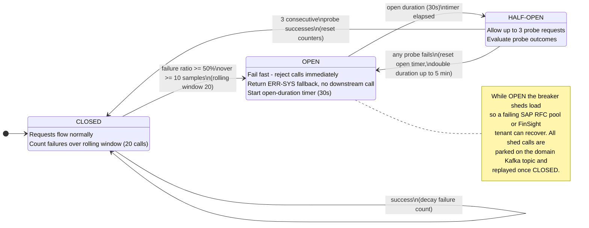

# D4 — Error Handling & Retry Framework (v1)

| | |
|---|---|
| **Project** | FDE-9B — Custom API Integration (SAP S/4HANA → Zetheta FinSight) |
| **Project code** | 493560B |
| **Client** | Meridian Manufacturing Ltd. |
| **Deliverable** | D4 — Error Handling & Retry Framework |
| **Submission name** | 493560B_AnutoshMishra_ErrorHandlingFramework |
| **Author** | Anutosh Mishra |
| **Version** | v1 |
| **Status** | Complete |
| **Related** | D1 Architecture, D3 Mappings, D5 Reconciliation, D6 Monitoring |

---

## 1. Purpose & scope

This deliverable specifies how the integration pipeline behaves when things go wrong. It covers
every failure surface between `SAP S/4HANA` and `Zetheta FinSight 4.2`: the `ODP Extractor`,
`Kafka`, the `Transformation Engine`, the `FinSight Loader`, and the cross-cutting `Reconciliation
Service` and `Monitoring Stack`.

The framework is built on five load-bearing decisions:

1. **Every error is classified** into one of four top-level classes and one of ten operational
   sub-classes before any action is taken. Classification is deterministic and encoded in the
   error-code registry (Section 9).
2. **Retries are bounded** by a per-class retry budget and use exponential backoff with jitter to
   avoid a thundering herd against a recovering SAP or FinSight instance.
3. **Circuit breakers** guard every inter-service boundary so a failing dependency sheds load
   instead of cascading.
4. **Bulkheads** isolate each of the ten data domains so a General Ledger incident cannot starve
   Accounts Payable.
5. **Nothing is silently dropped.** Anything that cannot be processed lands in a Dead Letter
   Queue (technical failures) or a Business Exception Queue (functional/business-rule failures),
   both of which are inspectable and replayable.

This design satisfies the **Resilience Master** badge requirement: it covers **all 10 error
classes** (Section 2.2) with **working retry formulas** (Section 3) and a complete error-code
registry (Section 9).

---

## 2. Error classification taxonomy

### 2.1 The four top-level classes

Classification answers one question: *what should the pipeline do next?* We deliberately keep the
top level to four mutually exclusive classes because each maps to a single default routing
decision.

| Class | Meaning | Recoverable by retry? | Default routing |
|---|---|---|---|
| **TRANSIENT** | A temporary condition (network blip, throttling, contention, pool exhaustion). The same request is expected to succeed later. | Yes, with backoff | Retry → on budget exhaustion → DLQ |
| **PERMANENT** | A deterministic failure of the request itself (bad auth, contract/schema breach, unrecoverable transformation). Retrying the identical request cannot succeed. | No | DLQ (technical) or Business Exception Queue (business rule) — no retry |
| **DATA_QUALITY** | The message is well-formed at the protocol level but the *content* fails a validation, referential-integrity, or reconciliation rule. | Sometimes (after correction/enrichment) | Bounded correction attempt → Business Exception Queue or DLQ |
| **SYSTEM** | The failure is in *our* infrastructure, not the message (broker down, disk full, node loss). The message is a victim, not a cause. | Yes, once infra recovers | Circuit break + park on source topic + P1/P2 alert; message is **not** discarded |

### 2.2 Sub-categories — the 10 operational error classes

The **Resilience Master** badge requires coverage of *all 10 error classes*. These are the ten
operational sub-classes below, nested under the four top-level classes. Every code in the
registry (Section 9) resolves to exactly one of these.

| # | Sub-class | Parent class | Trigger examples | Decision rule |
|---|---|---|---|---|
| 1 | **TRANSIENT-NETWORK** | TRANSIENT | RFC timeout, gateway timeout (504), connection reset | Retry with exponential backoff + jitter, budget = 3 |
| 2 | **TRANSIENT-THROTTLING** | TRANSIENT | HTTP 429, `RATE_LIMITED`, ODP frequency guard | Honour `Retry-After`; backoff + jitter; budget = 5 |
| 3 | **TRANSIENT-RESOURCE** | TRANSIENT | RFC pool exhausted (50/50), 409 `CONCURRENT_MODIFICATION` | Fixed 60s (pool) or 5s (optimistic-lock) wait, then retry; budget = 3–5 |
| 4 | **PERMANENT-AUTH** | PERMANENT | 401 `INVALID_TOKEN`, 403 `INSUFFICIENT_SCOPE`, 403 `TENANT_LOCKED` | Single token refresh only for expiry; otherwise no retry, alert Security |
| 5 | **PERMANENT-CONTRACT** | PERMANENT | 400 `INVALID_REQUEST`, schema breach, transform overflow | No retry → DLQ; open a schema-drift investigation |
| 6 | **PERMANENT-BUSINESS** | PERMANENT | 422 `BUSINESS_RULE_VIOLATION`, 404 `RESOURCE_NOT_FOUND` | No retry → **Business Exception Queue**; notify functional team |
| 7 | **DQ-FIELD** | DATA_QUALITY | Null in NOT-NULL target, bad date/currency format, range breach | Attempt one deterministic correction; on failure → DLQ |
| 8 | **DQ-REFERENTIAL** | DATA_QUALITY | Cost centre / GL account / vendor / customer not in master | Route to Business Exception Queue; may trigger master-data resync |
| 9 | **DQ-RECON** | DATA_QUALITY | Record-count mismatch, checksum variance, debit≠credit | Generate break report; exception workflow (see D5) |
| 10 | **SYSTEM-INFRA** | SYSTEM | Kafka broker unreachable, disk < 10%, node loss | Circuit break, park message, P1/P2 alert; never discard |

### 2.3 Decision rule — retry vs DLQ vs Business Exception Queue

The router applies the first matching rule, top to bottom:

```
classify(error) -> (top_class, sub_class, err_code)

IF top_class == SYSTEM:
        open circuit breaker for the affected boundary
        park message on its source Kafka topic (offset not committed)
        raise P1/P2 alert
        STOP  (no DLQ — message replays when infra recovers)

ELIF top_class == TRANSIENT:
        IF retry_count < budget(sub_class):
                schedule retry at wait = min(cap, random(base, base * 2^attempt))
        ELSE:
                envelope + route to DLQ  (retries_exhausted flag)

ELIF top_class == DATA_QUALITY:
        IF sub_class == DQ-FIELD AND deterministic_correction_available:
                apply correction, retry once
                on failure -> DLQ
        ELIF sub_class in (DQ-REFERENTIAL, PERMANENT-BUSINESS):
                route to BUSINESS EXCEPTION QUEUE  (functional owner)
        ELIF sub_class == DQ-RECON:
                hand to Reconciliation Service break workflow (D5)

ELIF top_class == PERMANENT:
        IF sub_class == PERMANENT-AUTH AND reason == token_expired AND not already_refreshed:
                refresh token, retry once
        ELIF sub_class == PERMANENT-BUSINESS:
                route to BUSINESS EXCEPTION QUEUE
        ELSE:
                route to DLQ  (no retry)
```

**Queue selection in one line:** *technical* dead-ends go to the **DLQ**; *business/functional*
dead-ends (a real-world master record is missing, a business rule is violated) go to the
**Business Exception Queue** where an accountant — not an engineer — is the right owner.

---

## 3. Retry strategy

### 3.1 Backoff formula (canonical)

```
wait = min(cap, random(base, base * 2^attempt))
```

- `base` = base interval (default **2 s**).
- `cap`  = maximum single wait (default **60 s**).
- `attempt` = 1-based retry attempt number.
- `random(lo, hi)` = uniform sample in `[lo, hi]` — this is the **jitter**, and it is what
  prevents thousands of parked messages from stampeding a recovering FinSight tenant at the same
  instant (full-jitter strategy).

### 3.2 Worked table — base = 2 s, cap = 60 s

For attempt *n*, the sample window is `[base, base·2ⁿ]` = `[2, 2·2ⁿ]`, then clamped to `cap`.

| Attempt (n) | `base · 2^n` | Sample window `random(base, base·2^n)` | Effective window after `min(cap, …)` | Min wait | Max wait | Expected (mean) wait | Cumulative expected elapsed |
|---|---|---|---|---|---|---|---|
| 1 | 4 s | [2 s, 4 s] | [2 s, 4 s] | 2 s | 4 s | 3.0 s | 3.0 s |
| 2 | 8 s | [2 s, 8 s] | [2 s, 8 s] | 2 s | 8 s | 5.0 s | 8.0 s |
| 3 | 16 s | [2 s, 16 s] | [2 s, 16 s] | 2 s | 16 s | 9.0 s | 17.0 s |
| 4 | 32 s | [2 s, 32 s] | [2 s, 32 s] | 2 s | 32 s | 17.0 s | 34.0 s |
| 5 | 64 s | [2 s, 64 s] | **[2 s, 60 s]** (capped) | 2 s | **60 s** | 31.0 s | 65.0 s |

Read the last row as: by the fifth attempt the upper bound of the sample window (64 s) exceeds the
60 s cap, so the effective maximum wait is clamped to 60 s. A message that exhausts all five
attempts has spent, on average, ~65 s in retry before it is enveloped and moved to the DLQ.

### 3.3 Per-error-class retry budgets and max attempts

| Sub-class | Strategy | `base` | `cap` | Max attempts | Retry budget scope | On exhaustion |
|---|---|---|---|---|---|---|
| TRANSIENT-NETWORK | Exp. backoff + jitter | 2 s | 60 s | 3 | Per message | DLQ |
| TRANSIENT-THROTTLING | Honour `Retry-After`, else exp. backoff + jitter | 2 s | 60 s | 5 | Per tenant (shared budget) | DLQ + rate-limit alert |
| TRANSIENT-RESOURCE (RFC pool) | Fixed wait | 60 s | 60 s | 3 | Per extractor | DLQ + pool-utilisation alert |
| TRANSIENT-RESOURCE (409 concurrent) | Fixed wait + optimistic-lock recheck | 5 s | 5 s | 3 | Per message | DLQ |
| PERMANENT-AUTH (token expired) | Single refresh | — | — | 1 | Per session | Alert Security, no further retry |
| PERMANENT-CONTRACT | None | — | — | 0 | — | DLQ immediately |
| PERMANENT-BUSINESS | None | — | — | 0 | — | Business Exception Queue |
| DQ-FIELD | One deterministic correction | — | — | 1 | Per message | DLQ |
| DQ-REFERENTIAL | None (may resync master) | — | — | 0 | — | Business Exception Queue |
| DQ-RECON | None (break workflow) | — | — | 0 | — | Reconciliation exception (D5) |
| SYSTEM-INFRA | Circuit-breaker gated replay | 5 s | 300 s | until CB closes | Per boundary | Park on source topic (never dropped) |

**Global retry-budget guard.** Beyond per-message budgets, each integration domain holds a
*token-bucket retry budget* of **10% of its request rate** over a rolling 60 s window. When the
bucket empties (i.e. more than one in ten calls is a retry), new retries for that domain are
suppressed and diverted straight to DLQ, and the domain circuit breaker is armed. This prevents a
retry storm from a partially-degraded FinSight tenant from consuming the entire RFC pool or
bandwidth budget (≤ 25% of 450 Mbps in business hours).

---

## 4. Circuit breaker

A circuit breaker sits on every inter-service boundary named in the D1 architecture:
`ODP Extractor → SAP Gateway/OData`, `FinSight Loader → FinSight /api/v2/`, and the internal
`Transformation Engine → Kafka` producer path. One breaker instance exists **per boundary per
domain** (so GL and AP have independent breakers against the same FinSight host).

### 4.1 State machine



*(Source: `diagrams/mermaid/DGM_State_CircuitBreaker.mmd`)*

### 4.2 Parameters

| Parameter | Value | Rationale |
|---|---|---|
| **Rolling window** | Last **20 calls** (sliding count window) | Large enough to smooth noise, small enough to react within seconds at 30-min extract cadence |
| **Minimum samples** | **10 calls** | Never trip on a tiny sample (avoids opening on the first two failures after a quiet period) |
| **Failure threshold** | **≥ 50%** failures in the window | Half the traffic failing is unambiguous degradation |
| **Trip counts** | TRANSIENT/SYSTEM failures and timeouts only | Business/DQ failures (4xx-content) do **not** trip the breaker — they are the message's fault, not the dependency's |
| **Open duration** | **30 s** (base), doubling on repeated trips up to **300 s** (5 min) cap | Gives SAP/FinSight time to recover; exponential re-open avoids flapping |
| **Half-open probe count** | **3** probe requests | Small canary against the recovering dependency |
| **Success threshold to close** | **3 consecutive** probe successes | Requires sustained recovery before restoring full traffic |
| **Half-open failure action** | Any single probe failure → back to OPEN, reset + double timer | Fail closed on the first sign the dependency is still sick |

### 4.3 Behaviour while OPEN

While a breaker is OPEN it emits an `ERR-SYS`-class fallback (fail fast, no downstream call) and
the affected messages are **parked on their domain Kafka topic with the consumer offset
uncommitted**. Nothing is lost: when the breaker returns to CLOSED, consumption resumes from the
parked offset. Every state transition emits a metric (`circuit_state{boundary,domain}`) to the
`Monitoring Stack` and a Slack/PagerDuty notification per Section 7.

---

## 5. Bulkhead & timeout policy

### 5.1 Bulkheads (resource isolation per integration domain)

Each of the ten data domains runs in its **own bulkhead**: a dedicated bounded thread pool,
connection allotment, and Kafka consumer group. A failure or saturation in one domain cannot
consume the resources of another. This directly honours the D1 constraint that GL processing
problems must not affect AP processing.

| Bulkhead resource | Allocation rule | Hard limit |
|---|---|---|
| SAP RFC connections | Partitioned across domains, weighted by mapping count | **≤ 50 concurrent total** (SAP Basis constraint) — e.g. GL 12, AP 8, AR 8, others pro-rata |
| Loader worker threads | Per-domain bounded pool | 8 threads/domain, queue depth 100, reject-and-DLQ on overflow |
| Kafka consumer group | One group per domain topic | Partitioned by company code (`MC01`/`MC02`/`MC03`) |
| Bandwidth | Shared token bucket | ≤ 25% of 450 Mbps during business hours |
| In-flight FinSight requests | Per-tenant semaphore | Max 20 concurrent per `MERIDIAN-MC0x` tenant |

When a bulkhead's queue is full, new work is **rejected fast** (rather than queued unboundedly)
and routed to DLQ with an `ERR-SYS` overflow marker — backpressure instead of memory exhaustion.

### 5.2 Timeout policy

Aggressive, tiered timeouts prevent a slow dependency from exhausting a bulkhead.

| Operation domain | Timeout | Applies to |
|---|---|---|
| **API call (synchronous)** | **5 s** | Single FinSight `/api/v2/` POST, single SAP OData read, token endpoint |
| **Batch operation** | **30 s** | ODP delta package fetch, bulk transform of a partition, multi-record load batch |
| Circuit-breaker probe (half-open) | 5 s | HALF-OPEN canary request |
| Token refresh | 5 s | OAuth 2.0 `refresh_token` / `client_credentials` grant |
| Reconciliation query | 30 s | Per-batch checksum/count query (D5) |

Every timeout maps to a `TRANSIENT-NETWORK` sub-class (`ERR-EXT-001` for RFC, `GATEWAY_TIMEOUT`
for FinSight) and enters the retry path in Section 3.

---

## 6. Dead Letter Queue (DLQ) design

### 6.1 Topic layout

The DLQ is a first-class part of the `Kafka` cluster (3 brokers, RF=3, ISR=2). We use a
**per-domain DLQ topic plus a shared catch-all**, so functional teams subscribe only to their own
domain's failures.

| Topic | Purpose | Partitions | Replication |
|---|---|---|---|
| `dlq.gl`, `dlq.ap`, `dlq.ar`, `dlq.cc`, `dlq.pc`, `dlq.ml`, `dlq.po`, `dlq.so`, `dlq.fa`, `dlq.bank` | Per-domain technical dead letters | 3 (by company code) | RF=3 |
| `bizex.<domain>` | Business Exception Queue per domain (functional owners) | 3 | RF=3 |
| `dlq.global` | Catch-all for SYSTEM-class overflow and unclassifiable messages | 6 | RF=3 |
| `dlq.reprocess` | Staging topic for operator-approved replays | 3 | RF=3 |

### 6.2 Retention

- **DLQ / Business Exception topics: 14-day retention** (`retention.ms = 1209600000`), extended
  well beyond the default operational topics so that a Monday incident is still inspectable the
  following Monday and survives a month-boundary audit cycle.
- `dlq.reprocess` retention: 7 days (transient staging).
- Compaction is **off** on DLQ topics — every failed attempt is an audit-relevant event and must
  be preserved.

### 6.3 Payload envelope

Every message routed to a DLQ / Business Exception topic is wrapped in a standard envelope. The
**original message is preserved byte-for-byte** so a replay is faithful.

```json
{
  "envelope_version": "1.0",
  "correlation_id": "a2f1c9e0-7b3d-4f2a-9c14-8d6e5b1a0f77",
  "batch_id": "BATCH-GL-20260315-0930",
  "source_endpoint": "SRC-001",
  "dest_endpoint": "DST-001",
  "domain": "General Ledger",
  "company_code": "MC01",
  "tenant": "MERIDIAN-MC01",
  "business_key": "MC01-2026-1900004521",
  "error": {
    "err_code": "ERR-MAP-001",
    "top_class": "DATA_QUALITY",
    "sub_class": "DQ-FIELD",
    "http_status": null,
    "message": "Source field ACDOCA.RACCT is NULL but target glAccount is NOT NULL",
    "stage": "TRANSFORM",
    "first_seen": "2026-03-15T09:32:10+05:30",
    "last_seen": "2026-03-15T09:32:12+05:30"
  },
  "retry_count": 3,
  "retry_budget": 3,
  "retries_exhausted": true,
  "circuit_state_at_failure": "CLOSED",
  "original_message": {
    "headers": { "Idempotency-Key": "MC01-2026-1900004521", "content-type": "application/json" },
    "payload": "<<verbatim original Kafka record value>>"
  },
  "audit": {
    "sap_document_number": "1900004521",
    "sap_fiscal_year": "2026",
    "wiretap_offset": "domain.gl-2:48210"
  }
}
```

**Mandatory envelope fields:** `correlation_id`, `batch_id`, `err_code`, `top_class`/`sub_class`,
`retry_count`, `original_message` (verbatim), and the `audit.sap_document_number` needed for
lineage (D5). `correlation_id` is generated at extraction and threads through every stage, so a
DLQ record can be traced end to end in ELK.

### 6.4 Manual inspection & reprocessing workflow

```
1. DETECT      Monitoring Stack alerts on dlq_depth{domain} crossing threshold (Section 7);
               PagerDuty/Slack notifies the owning team.

2. INSPECT     Operator opens the DLQ record in Kibana (indexed by correlation_id, err_code,
               domain, batch_id). Envelope shows the exact failure and the verbatim original.

3. TRIAGE      By err_code family:
                 - ERR-MAP-* / DQ-FIELD ....... fix mapping or reference data
                 - ERR-EXT-* / TRANSIENT ...... usually already recovered; safe to replay
                 - PERMANENT-BUSINESS ......... hand to functional owner via bizex.<domain>
                 - ERR-SYS-* .................. confirm infra healthy before replay

4. REMEDIATE   Apply the fix (correct master data, patch mapping version, restore scope, etc.).

5. REPROCESS   Operator selects records and publishes them to dlq.reprocess. A guarded
               reprocessor re-injects the ORIGINAL message onto the domain's inbound topic
               with the SAME Idempotency-Key, so already-loaded records are skipped
               (409 DUPLICATE_ENTRY -> idempotent no-op) and only the genuinely failed
               records are re-attempted.

6. VERIFY      Reconciliation Service re-runs for the affected batch_id (D5); DLQ depth for the
               domain must return to its pre-incident baseline. The reprocess action, operator,
               and outcome are written to the audit log.
```

Reprocessing is **idempotent by construction**: because the FinSight `POST` idempotency key is the
business key (e.g. `documentId`), replaying a message that actually succeeded on a later attempt is
harmless.

---

## 7. Error notification matrix

Severity drives channel and SLA. P1 pages a human immediately; P4 is a digest line.

| Error class / condition | Example codes | Severity | Channel | Who | Response SLA | Resolution SLA |
|---|---|---|---|---|---|---|
| SYSTEM-INFRA (broker down, node loss) | ERR-SYS-001 | **P1** | PagerDuty (page) + Slack `#fde9b-oncall` | Infra on-call | 5 min ack | 1 h |
| Circuit breaker OPEN on a domain | (state event) | **P1** | PagerDuty + Slack | Integration on-call | 5 min ack | 1 h |
| PERMANENT-AUTH (invalid/revoked token, tenant locked) | INVALID_TOKEN, TENANT_LOCKED, INSUFFICIENT_SCOPE | **P2** | PagerDuty (low-urgency) + Slack `#fde9b-security` | Security + PM | 15 min ack | 4 h |
| Disk / resource pressure | ERR-SYS-002 | **P2** | PagerDuty + Slack | Infra on-call | 15 min ack | 4 h |
| DQ-RECON break (count/checksum/debit≠credit) | ERR-RECON-001/002/003 | **P2** | Slack `#fde9b-recon` + email Data Steward | Data Steward | 30 min | Same business day |
| TRANSIENT storm (retry budget exhausted, rising DLQ) | ERR-EXT-002, RATE_LIMITED | **P3** | Slack `#fde9b-alerts` | Integration eng | 1 h | Next business day |
| DQ-FIELD / DQ-REFERENTIAL to DLQ / BizEx | ERR-MAP-001..005, RESOURCE_NOT_FOUND | **P3** | Slack `#fde9b-<domain>` + email functional team | Functional owner (AP/AR/GL) | 4 h | Next business day |
| PERMANENT-BUSINESS to Business Exception Queue | BUSINESS_RULE_VIOLATION, REFERENTIAL_INTEGRITY | **P3** | Business Exception Queue + email | Functional owner | 4 h | 2 business days |
| Single record to DLQ (isolated, below threshold) | any | **P4** | Daily digest email + Grafana panel | Domain team | Next business day | Weekly review |
| Schema drift suspected (rising PERMANENT-CONTRACT) | INVALID_REQUEST cluster | **P2** | PagerDuty + Slack `#fde9b-eng` | Integration eng | 15 min | 4 h |

Notification routing lives in the `Monitoring Stack` (Prometheus Alertmanager → PagerDuty/Slack;
ELK-driven digests for P4). All P1/P2 alerts carry the `correlation_id` and a Kibana deep-link.

---

## 8. Class → sub-class → action quick reference

| Top class | Sub-class | Primary queue on dead-end | Retries | Trips breaker? | Alerts at |
|---|---|---|---|---|---|
| TRANSIENT | NETWORK | DLQ | 3, exp+jitter | Yes | P3 |
| TRANSIENT | THROTTLING | DLQ | 5, `Retry-After` | Yes (503 only) | P3 |
| TRANSIENT | RESOURCE | DLQ | 3–5, fixed | Yes | P2/P3 |
| PERMANENT | AUTH | (alert) | 1 refresh max | No | P2 |
| PERMANENT | CONTRACT | DLQ | 0 | No | P2 (drift) |
| PERMANENT | BUSINESS | Business Exception Queue | 0 | No | P3 |
| DATA_QUALITY | DQ-FIELD | DLQ | 1 correction | No | P3/P4 |
| DATA_QUALITY | DQ-REFERENTIAL | Business Exception Queue | 0 | No | P3 |
| DATA_QUALITY | DQ-RECON | Recon break workflow (D5) | 0 | No | P2 |
| SYSTEM | SYSTEM-INFRA | Park on source topic | until CB closes | Yes | P1 |

---

## 9. Error-code registry (complete)

The registry is the single authoritative lookup used by the router. It merges **Appendix J**
(`ERR-EXT-*`, `ERR-MAP-*`, `ERR-LOAD-*`, `ERR-RECON-*`, `ERR-SYS-*`, plus the `ERR-VAL-*` family
referenced by the reconciliation template) with **every FinSight HTTP error code from Appendix B**.
Each row carries: code, class (top / sub), source, description, default action, and retry policy.

### 9.1 Integration error codes (Appendix J family)

| Code | Top class | Sub-class | Source | Description | Default action | Retry policy |
|---|---|---|---|---|---|---|
| **ERR-EXT-001** | TRANSIENT | NETWORK | SAP RFC | RFC connection timeout after 30 s | Retry with exponential backoff + jitter | base 2 s, cap 60 s, max 3 |
| **ERR-EXT-002** | TRANSIENT | RESOURCE | SAP RFC | RFC connection pool exhausted (all 50 in use) | Wait and retry; fire pool-utilisation alert | fixed 60 s, max 3 |
| **ERR-EXT-003** | PERMANENT | CONTRACT | SAP ODP | ODP subscription invalidated (provider structure changed) | Alert integration team; **halt extraction** for this domain | none (0) |
| **ERR-EXT-004** | TRANSIENT | NETWORK | SAP ODP | ODP delta returned empty despite known changes | Retry once; if still empty check ODP monitor (RSA1) | base 2 s, max 1 |
| **ERR-MAP-001** | DATA_QUALITY | DQ-FIELD | Transformation | Source field NULL but target requires NOT NULL | Apply default if defined, else DLQ | 1 correction attempt |
| **ERR-MAP-002** | DATA_QUALITY | DQ-FIELD | Transformation | Date format invalid (not YYYYMMDD / not a valid date) | Attempt format correction; if fails, DLQ | 1 correction attempt |
| **ERR-MAP-003** | DATA_QUALITY | DQ-REFERENTIAL | Transformation | Referenced cost centre not found in master data | Route to Business Exception Queue; notify functional team | none (0) |
| **ERR-MAP-004** | DATA_QUALITY | DQ-FIELD | Transformation | Currency code not found in ISO 4217 lookup | Check common typos (RS vs INR); else DLQ | 1 correction attempt |
| **ERR-MAP-005** | DATA_QUALITY | DQ-FIELD | Transformation | Exchange rate not found for currency pair + date | Use nearest available date rate with **stale-rate flag** | 1 correction attempt |
| **ERR-MAP-006** | PERMANENT | CONTRACT | Transformation | Transformation rule execution error (div-by-zero, overflow) | Log full context, route to DLQ, alert engineering | none (0) |
| **ERR-VAL-007** | DATA_QUALITY | DQ-FIELD | Transformation/Validation | Future posting date (outside fiscal year ± 1 month) | Route to DLQ; flag for functional review | none (0) |
| **ERR-LOAD-001** | TRANSIENT | THROTTLING | FinSight API | HTTP 429 Too Many Requests | Honour `Retry-After`, backoff + jitter | base 2 s, cap 60 s, max 5 |
| **ERR-LOAD-002** | TRANSIENT | THROTTLING | FinSight API | HTTP 503 Service Unavailable | Linear backoff 60 s intervals, then circuit break | fixed 60 s, max 5 |
| **ERR-LOAD-003** | PERMANENT | BUSINESS | FinSight API | HTTP 422 Business Rule Violation | Route to Business Exception Queue, no retry | none (0) |
| **ERR-LOAD-004** | PERMANENT | BUSINESS | FinSight API | HTTP 409 Duplicate Entry (idempotent) | Compare payloads: skip if identical, alert if different | none (0) |
| **ERR-LOAD-005** | PERMANENT | AUTH | FinSight API | HTTP 401 Authentication Failure | Refresh token once; if still failing, alert Security | 1 refresh only |
| **ERR-RECON-001** | DATA_QUALITY | DQ-RECON | Reconciliation | Record-count mismatch between source and target | Generate break report, trigger investigation workflow | none (0) |
| **ERR-RECON-002** | DATA_QUALITY | DQ-RECON | Reconciliation | Checksum variance exceeds tolerance threshold | Generate break report, escalate to Data Steward | none (0) |
| **ERR-RECON-003** | DATA_QUALITY | DQ-RECON | Reconciliation | Referential integrity violation in target | Identify missing master data, trigger master-data resync | none (0) |
| **ERR-SYS-001** | SYSTEM | SYSTEM-INFRA | Infrastructure | Kafka broker unreachable | Trigger circuit breaker, alert infrastructure **P1** | park + replay when CB closes |
| **ERR-SYS-002** | SYSTEM | SYSTEM-INFRA | Infrastructure | Disk space below 10% on processing node | Alert infra, archive old logs, request expansion | park + replay |

### 9.2 FinSight HTTP error codes (Appendix B — complete)

Each FinSight HTTP response is mapped to the internal taxonomy and, where applicable, to the
`ERR-LOAD-*` code that wraps it.

| HTTP | FinSight code | Top class | Sub-class | Source | Description | Default action | Retry policy |
|---|---|---|---|---|---|---|---|
| 400 | **INVALID_REQUEST** | PERMANENT | CONTRACT | FinSight API | Request body fails JSON schema validation | Parse validation errors, log specifics, route to DLQ | none (0) |
| 400 | **INVALID_DATE_FORMAT** | DATA_QUALITY | DQ-FIELD | FinSight API | Date field not ISO 8601 (YYYY-MM-DD) | Transform date format and retry once; else DLQ | max 1 |
| 400 | **INVALID_CURRENCY_CODE** | DATA_QUALITY | DQ-FIELD | FinSight API | Currency code not valid ISO 4217 (3-letter) | Check currency mapping table, apply correction if known, else DLQ | max 1 |
| 401 | **TOKEN_EXPIRED** | TRANSIENT | (AUTH-recoverable) | FinSight API | OAuth 2.0 access token expired | Auto-refresh via `refresh_token` grant and retry | 1 refresh + retry |
| 401 | **INVALID_TOKEN** | PERMANENT | AUTH | FinSight API | Token malformed, revoked, or wrong issuer | Re-authenticate from scratch, alert Security, no auto-retry | none (0) |
| 403 | **INSUFFICIENT_SCOPE** | PERMANENT | AUTH | FinSight API | Token lacks required OAuth scope for endpoint | Alert platform admin, request scope addition, no retry | none (0) |
| 403 | **TENANT_LOCKED** | PERMANENT | AUTH | FinSight API | Tenant locked (maintenance or billing) | Alert PM, pause pipeline for this tenant, no retry | none (0) |
| 404 | **RESOURCE_NOT_FOUND** | DATA_QUALITY | DQ-REFERENTIAL | FinSight API | Referenced master-data entity absent in target | Check master-data sync status, route to Business Exception Queue | none (0) |
| 409 | **DUPLICATE_ENTRY** | PERMANENT | BUSINESS | FinSight API | Record with same business key already exists | Compare payloads: identical → skip (idempotent); different → alert | none (0) |
| 409 | **CONCURRENT_MODIFICATION** | TRANSIENT | RESOURCE | FinSight API | Another process is modifying the same resource | Retry after 5 s with optimistic-locking recheck | fixed 5 s, max 3 |
| 422 | **BUSINESS_RULE_VIOLATION** | PERMANENT | BUSINESS | FinSight API | Data violates platform business rules | Log full context with rule name, route to Business Exception Queue | none (0) |
| 422 | **REFERENTIAL_INTEGRITY** | DATA_QUALITY | DQ-REFERENTIAL | FinSight API | Referenced entity (cost centre, GL account) doesn't exist | Check master-data dependency; may need to sync master first | none (0) |
| 429 | **RATE_LIMITED** | TRANSIENT | THROTTLING | FinSight API | Too many requests, rate limit exceeded | Honour `Retry-After`, exponential backoff + jitter | base 2 s, cap 60 s, max 5 |
| 500 | **INTERNAL_ERROR** | TRANSIENT | NETWORK | FinSight API | Unexpected server-side platform error | Retry with exponential backoff, then DLQ | base 2 s, max 3 |
| 503 | **SERVICE_UNAVAILABLE** | TRANSIENT | THROTTLING | FinSight API | Platform under maintenance or overloaded | Retry linear 60 s intervals, then circuit break | fixed 60 s, max 5 |
| 504 | **GATEWAY_TIMEOUT** | TRANSIENT | NETWORK | FinSight API | Upstream service timeout | Retry once after 30 s, then DLQ with timeout flag | fixed 30 s, max 1 |

> **Class-coverage confirmation (Resilience Master):** the registry exercises all **10 operational
> error classes** — NETWORK, THROTTLING, RESOURCE (TRANSIENT); AUTH, CONTRACT, BUSINESS
> (PERMANENT); DQ-FIELD, DQ-REFERENTIAL, DQ-RECON (DATA_QUALITY); and SYSTEM-INFRA (SYSTEM) — each
> with a defined, working retry formula or an explicit no-retry routing rule.

---

## 10. Assumptions & cross-references

- `TOKEN_EXPIRED` is classed TRANSIENT (recoverable via a single refresh) whereas `INVALID_TOKEN`
  is PERMANENT-AUTH — the distinction is deliberate and drives whether we auto-retry.
- Retry budgets and timeouts assume the D1 constraints: ≤ 50 concurrent RFC, ODP ≤ once/30 min,
  ≤ 25% bandwidth in business hours, all processing in AWS `ap-south-1`.
- DLQ replay relies on FinSight idempotency (`Idempotency-Key = documentId`) defined in D2.
- DQ-RECON handling is specified end to end in **D5 — Reconciliation & Data Quality**.
- All alert channels and thresholds are elaborated in **D6 — Monitoring & Alerting**.

*End of D4.*
