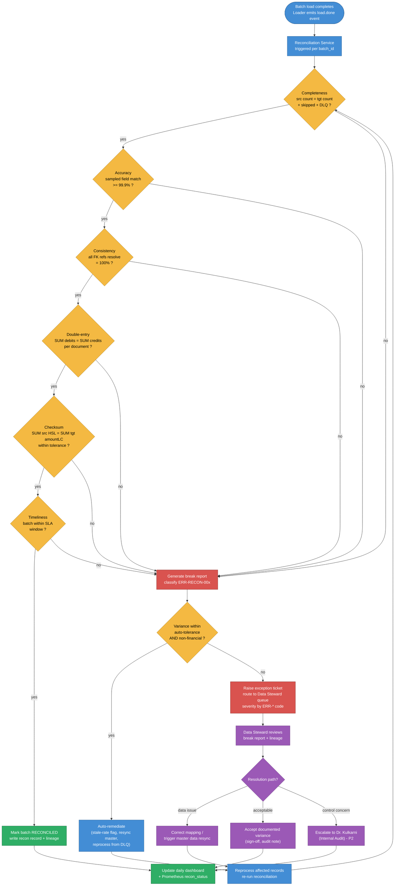

# D5 — Reconciliation & Data Quality (v1)

| | |
|---|---|
| **Project** | FDE-9B — Custom API Integration (SAP S/4HANA → Zetheta FinSight) |
| **Project code** | 493560B |
| **Client** | Meridian Manufacturing Ltd. |
| **Deliverable** | D5 — Reconciliation & Data Quality |
| **Submission name** | 493560B_AnutoshMishra_ReconciliationDataQuality |
| **Author** | Anutosh Mishra |
| **Version** | v1 |
| **Status** | Complete |
| **Related** | D3 Mappings, D4 Error Handling, D6 Monitoring, D9 Stakeholder (Dr. Kulkarni) |

---

## 1. Purpose & scope

Reconciliation is the mathematical proof that every rupee extracted from `SAP S/4HANA` arrives —
correctly, once, and on time — in `Zetheta FinSight 4.2`. For a manufacturer with ~2.1M financial
transactions/month across three company codes, manual review is impossible, so reconciliation is
**automated by default and human-driven only on exception**.

This deliverable defines:

1. Four reconciliation **dimensions** (Completeness, Accuracy, Timeliness, Consistency) with
   method, formula, and tolerance.
2. The **double-entry integrity** and **checksum** checks that give Internal Audit a zero-break
   guarantee.
3. Three **report specifications** — per-batch, daily dashboard, and monthly audit — with full
   SAP-document-to-FinSight-record **lineage** for Dr. Kulkarni.
4. The **automated reconciliation process** with an exception-based human-intervention workflow.
5. **25+ data quality rules** across six categories, mapped to the six DMBOK dimensions and their
   targets, each linked to an `ERR-*` action code from D4.

Targets (canonical, DMBOK):

| Dimension | Target |
|---|---|
| Completeness | > 99.5% |
| Accuracy | > 99.9% |
| Consistency | 100% |
| Timeliness | > 98% |
| Validity | > 99% |
| Uniqueness | 100% |
| Debit–credit variance per document | 0.00 |
| Break target across 10 domains | Zero-break |

---

## 2. Four reconciliation dimensions

Reconciliation runs per `batch_id` immediately after the `FinSight Loader` reports completion, and
is orchestrated by the `Reconciliation Service`. Each dimension has a deterministic method,
formula, and tolerance; a breach raises the mapped `ERR-RECON-*` code (D4) and enters the exception
workflow (Section 6).

### 2.1 Completeness — *did everything arrive?*

- **Method:** count-based conservation check. Every record extracted must be accounted for as
  loaded, skipped (idempotent duplicate), or dead-lettered — nothing may vanish.
- **Formula:**
  ```
  Completeness% = (Records Loaded + Records Skipped + Records in DLQ) / Records Extracted * 100
  Balanced IF  Records Extracted == Records Loaded + Records Skipped + Records Failed(DLQ)
  ```
- **Tolerance:** the conservation identity must hold **exactly** (zero unexplained loss). The
  *loaded* fraction target is **> 99.5%**; the remainder must be explicitly in DLQ/BizEx with a
  reason code. Any unaccounted record → **ERR-RECON-001** (P2).

### 2.2 Accuracy — *is each value correct after transformation?*

- **Method:** field-level comparison of source vs transformed target on a statistically valid
  sample (100% on monetary fields; ≥ 5% stratified sample or full on dimensional fields), after
  applying the D3 transformation rules in reverse where deterministic.
- **Formula:**
  ```
  Accuracy% = (Records where all compared fields match) / (Records compared) * 100
  ```
- **Tolerance:** **> 99.9%**. Monetary fields are compared at **zero tolerance** after rounding to
  2 decimals in group currency INR. A mismatch → **ERR-RECON-002** (checksum) or a DQ rule failure
  (Section 7).

### 2.3 Timeliness — *did the batch land inside its SLA window?*

- **Method:** compare batch load-completion timestamp against the domain's SLA window derived from
  its extraction frequency (30 min / 60 min / 4 h / daily / event).
- **Formula:**
  ```
  Timeliness% = (Batches completing within SLA window) / (Total batches) * 100
  Batch is on-time IF (Load Completion Timestamp - Window Start) <= SLA(domain)
  ```
- **Tolerance:** **> 98%** of batches on time; overarching data-freshness SLA **≤ 4 h**
  (down from 24 h — the 83% improvement headline for the CFO). A miss → timeliness flag on the
  dashboard, P3 if isolated, P2 if the ≤ 4 h freshness SLA is at risk.

### 2.4 Consistency — *do all cross-references resolve?*

- **Method:** referential-integrity resolution across datasets — GL→cost centre, GL→profit
  centre, AP→vendor, AR→customer, PO→vendor — plus master-before-transactional ordering.
- **Formula:**
  ```
  Consistency% = (Cross-references that resolve in target) / (Total cross-references) * 100
  ```
- **Tolerance:** **100%** — every foreign key must resolve. An unresolved reference →
  **ERR-RECON-003**, triggering a master-data resync before the transactional record is retried.

---

## 3. Double-entry integrity & checksum reconciliation

### 3.1 Double-entry integrity (per document)

Accounting's invariant is that debits equal credits within every financial document. In `ACDOCA`
the debit/credit indicator is `DRCRK` (`S` = debit/Soll, `H` = credit/Haben) and the amount in
group currency is `HSL`.

```
For each SAP documentId (BUKRS-GJAHR-BELNR):
    SUM(HSL where DRCRK = 'S')  ==  SUM(HSL where DRCRK = 'H')

Debit-Credit Balance Variance = SUM(debit) - SUM(credit)      -- MUST equal 0.00
```

- **Tolerance:** **INR 0.00 per document** (zero variance). Any non-zero variance →
  **ERR-RECON-002**, the document is quarantined (not partially loaded), and a break report is
  raised. Partial documents are never allowed into FinSight — a document loads atomically or not
  at all.

### 3.2 Checksum reconciliation (source HSL sums vs target amountLC sums)

Beyond per-document balance, we reconcile aggregate money moved per batch: the sum of source `HSL`
must equal the sum of target `amountLC` (the D3 target field, `DECIMAL(HSL,2)` in group currency).

```
Source Checksum (Debit)  = SUM(ACDOCA.HSL  where DRCRK='S')
Source Checksum (Credit) = SUM(ACDOCA.HSL  where DRCRK='H')
Target Checksum (Debit)  = SUM(amountLC    where type='DEBIT')
Target Checksum (Credit) = SUM(amountLC    where type='CREDIT')

Reconciled IF  Source Checksum (Debit)  == Target Checksum (Debit)
          AND  Source Checksum (Credit) == Target Checksum (Credit)
          AND  Source(Debit) == Source(Credit)           -- double-entry holds at batch level too
```

- **Tolerance:** **INR 0.00** for monetary checksums (2-decimal rounding in INR). A currency-mixed
  batch is reconciled in group currency INR only, after point-in-time conversion (D3), so rounding
  is applied once at the target. Any variance beyond 0.00 → **ERR-RECON-002**, escalate to Data
  Steward. The GST breakdown (CGST/SGST/IGST) is reconciled as a secondary checksum on
  invoice-bearing domains so the tax split is preserved end to end.

---

## 4. Report specifications

### 4.1 (a) Per-batch reconciliation report

Produced for **every** batch, persisted 13 months (audit horizon), and the atomic unit of the
zero-break guarantee. This expands the canonical template with every field, adding lineage, GST,
and per-dimension outcome rows.

| Field | Example Value | Notes |
|---|---|---|
| Batch ID | `BATCH-GL-20260315-0930` | Domain-date-time key |
| Correlation ID (root) | `a2f1c9e0-7b3d-4f2a-9c14-8d6e5b1a0f77` | Threads to D4 envelope / ELK |
| Extraction Timestamp | `2026-03-15T09:30:00+05:30` | IST |
| Load Completion Timestamp | `2026-03-15T09:32:45+05:30` | IST |
| Data Domain | General Ledger Journal Entries | One of the 10 domains |
| Source System | SAP S/4HANA (PRD, Client 100, Company Code MC01) | |
| Target System | Zetheta FinSight (Tenant: MERIDIAN-MC01) | Canonical tenant routing |
| Source Endpoint / Dest Endpoint | SRC-001 / DST-001 | |
| Extraction Method | ODP Delta via CDS View ZZ_CDS_ACDOCA_DELTA | |
| Delta Token (Previous) | `20260315_090000_000001` | Not advanced on failure |
| Delta Token (Current) | `20260315_093000_000001` | |
| Records Extracted from Source | 6,247 | |
| Records Passed Validation | 6,243 | |
| Records Failed Validation | 4 | |
| Records Transformed Successfully | 6,243 | |
| Records Loaded to Target | 6,241 | |
| Records Skipped (Idempotent Duplicates) | 2 | 409 DUPLICATE_ENTRY, identical payload |
| **Completeness check** | PASS (6,241 + 2 + 4 = 6,247) | Conservation identity |
| **Completeness %** | 99.94% loaded | Target > 99.5% |
| Source Checksum (SUM HSL where DRCRK=S) | INR 24,17,89,342.30 (Debit) | |
| Source Checksum (SUM HSL where DRCRK=H) | INR 24,17,89,342.30 (Credit) | |
| Target Checksum (SUM amountLC where type=DEBIT) | INR 24,17,89,342.30 | |
| Target Checksum (SUM amountLC where type=CREDIT) | INR 24,17,89,342.30 | |
| **Debit-Credit Balance Variance** | INR 0.00 | MUST be 0.00 |
| **Checksum Variance (Source vs Target)** | INR 0.00 | MUST be 0.00 |
| GST Checksum (CGST / SGST / IGST) | INR 0.00 variance | Invoice-bearing domains only |
| **Accuracy %** (sampled field match) | 100.00% | Target > 99.9% |
| **Consistency %** (cross-refs resolved) | 100.00% | Target 100% |
| **Timeliness** | ON-TIME (2m45s ≤ 30-min window) | Target > 98% |
| Source-Target Record Count Variance | 4 (failed validation, routed to DLQ) | |
| Reconciliation Status | RECONCILED (all loaded records match; 4 in DLQ for review) | RECONCILED / BREAK / RECONCILED-WITH-EXCEPTIONS |
| Top Error: ERR-MAP-003 (Invalid cost centre ref) | 3 records | Links to D4 registry |
| Top Error: ERR-VAL-007 (Future posting date) | 1 record | Links to D4 registry |
| DLQ Records Routed This Batch | 4 | |
| Business Exception Queue Records | 3 | DQ-REFERENTIAL routed to functional team |
| Cumulative DLQ Depth | 17 | |
| Total Processing Duration | 2 minutes 45 seconds | |
| Extraction Duration | 1 minute 12 seconds | |
| Transformation Duration | 0 minutes 48 seconds | |
| Loading Duration | 0 minutes 45 seconds | |
| Throughput | 37.8 records/second | |
| Lineage anchor | SAP docs 1900004521…1900010768 → FinSight `/journal-entries` ids | Sample range; full map in audit report |
| Reconciled By | Reconciliation Service (auto) | Or steward name on exception |
| Sign-off | AUTO-SIGNED (no break) | Steward sign-off on exceptions |

### 4.2 (b) Daily reconciliation dashboard summary

A single Grafana view (fed by the `Monitoring Stack`) rolling up all batches across the 10 domains
and 3 company codes for the IST business day. One row per domain, plus a group total.

| Panel / Field | Description | Healthy example |
|---|---|---|
| Reconciliation status heat-map | Per domain × company code: RECONCILED / BREAK | All green |
| Batches reconciled | Count reconciled / total for the day | 480 / 480 |
| Zero-break streak | Consecutive days with no break across all 10 domains | 42 days |
| Completeness (day) | Loaded ÷ extracted, all domains | 99.97% (> 99.5%) |
| Accuracy (day) | Sampled field-match rate | 99.98% (> 99.9%) |
| Consistency (day) | Cross-refs resolved | 100% |
| Timeliness (day) | Batches within SLA | 99.2% (> 98%) |
| Validity (day) | Records passing all DQ rules | 99.6% (> 99%) |
| Uniqueness (day) | Unique business keys in target | 100% |
| Debit-credit variance (day) | Sum of per-document variances | INR 0.00 |
| Total money reconciled | Group-currency checksum moved today | INR 3,142.6 cr |
| Open breaks | Count + oldest age, by severity | 0 open |
| DLQ depth trend | Current depth + 24 h sparkline per domain | 17, flat |
| Business Exception Queue depth | Open functional exceptions by domain | 3 (AP) |
| Stale-rate flags | Records loaded on nearest-date FX rate (ERR-MAP-005) | 6 |
| Data freshness | Max lag SAP posting → FinSight visible | 38 min (≤ 4 h SLA) |

The dashboard is the P3/P4 surface for domain teams and the CFO's freshness promise; any red cell
deep-links to the offending per-batch report and its break tickets.

### 4.3 (c) Monthly audit report — for Dr. Sanjay Kulkarni (Head, Internal Audit)

A formal, sign-off-bearing document with **full lineage from SAP document number to FinSight
record**, satisfying the RBI/audit requirement for complete data lineage.

**Structure:**

1. **Executive control statement** — attestation that for the period, debit–credit variance was
   INR 0.00 per document and checksum variance INR 0.00 per batch across all 10 domains, or an
   enumerated list of documented exceptions with steward sign-off.
2. **Coverage summary** — transactions processed per domain / company code / plant, money
   reconciled, zero-break status.
3. **Dimension scorecard** — monthly Completeness / Accuracy / Consistency / Timeliness / Validity
   / Uniqueness vs targets, with trend vs prior month.
4. **Exception register** — every break in the period: `ERR-RECON-*` / `ERR-*` code, records
   affected, root cause, remediation, steward, resolution date, residual risk.
5. **Full lineage appendix** — the auditable chain, one row per reconciled document:

   | SAP Document Number | BUKRS / GJAHR / BELNR | Document Type | Posting Date | Special Period (013–016) | Source Delta Token | Batch ID | Correlation ID | FinSight Resource | FinSight Record ID | amountLC (INR) | GST Split (C/S/I) | Recon Status |
   |---|---|---|---|---|---|---|---|---|---|---|---|---|
   | 1900004521 | MC01/2026/1900004521 | SA (G/L doc) | 2026-03-15 | — | 20260315_093000_000001 | BATCH-GL-20260315-0930 | a2f1c9e0… | /journal-entries | JE-MC01-8f22a1 | 41,20,000.00 | 0/0/0 | RECONCILED |

6. **Attestation & sign-off** — Reconciliation Service hash of the underlying batch reports
   (tamper-evidence), Data Steward sign-off, and space for the Internal Audit sign-off. The report
   is generated from the immutable per-batch reports and the `Audit/Wire-Tap` log, so the lineage
   is reproducible on demand.

---

## 5. Automated reconciliation process (with exception-based human intervention)

### 5.1 Flow



*(Source: `diagrams/mermaid/DGM_DataFlow_ReconProcess.mmd`)*

### 5.2 Exception-based human intervention

- **Auto path (no human):** a batch that passes all six checks is auto-signed and only ever seen as
  a green cell. Breaks whose variance is within an auto-tolerance **and** non-financial (e.g. a
  stale-FX flag, a master record that a resync will fix) are auto-remediated and re-reconciled.
- **Human path (exception only):** a financial variance (debit≠credit, checksum ≠ 0) or an
  unresolved data issue raises a ticket to the **Data Steward** queue, severity set by the `ERR-*`
  code per D4's notification matrix (DQ-RECON = P2). The steward chooses: fix the data and
  reprocess, accept a documented variance with sign-off, or escalate a control concern to Dr.
  Kulkarni. Every decision is written to the audit log and surfaces in the monthly report.
- **Reprocessing** reuses the D4 DLQ replay path: the original message is re-injected with the same
  `Idempotency-Key`, so already-good records are idempotent no-ops and only the break is retried.

---

## 6. Data quality rules

### 6.1 Category → DMBOK dimension mapping

The six rule categories map to the six DMBOK dimensions and their canonical targets:

| Category | Primary DMBOK dimension | Target |
|---|---|---|
| Null checks | Completeness | > 99.5% |
| Format validation | Validity | > 99% |
| Range checks | Validity / Accuracy | > 99% / > 99.9% |
| Referential integrity | Consistency | 100% |
| Cross-field validation | Accuracy | > 99.9% |
| Business rules | Validity / Uniqueness / Timeliness | > 99% / 100% / > 98% |

### 6.2 Rule register (27 rules)

Severity: **CRITICAL** (block record, route per action), **HIGH** (route to DLQ/BizEx),
**MEDIUM** (load with flag), **LOW** (log only). Action codes reference the D4 registry.

| Rule ID | Category | DMBOK dimension | Domain | Rule description | Severity | Action on failure (D4 code) |
|---|---|---|---|---|---|---|
| **DQ-001** | Null check | Completeness | GL | `ACDOCA.RACCT` (GL account) → `glAccount` must be NOT NULL | CRITICAL | ERR-MAP-001 → DLQ |
| **DQ-002** | Null check | Completeness | GL | `documentId` composite (BUKRS-GJAHR-BELNR) must be fully populated | CRITICAL | ERR-MAP-001 → DLQ |
| **DQ-003** | Null check | Completeness | GL | `postingDate` (`BUDAT`) must be NOT NULL | CRITICAL | ERR-MAP-001 → DLQ |
| **DQ-004** | Null check | Completeness | AP | Vendor id (`LFA1.LIFNR`) must be NOT NULL on payable | CRITICAL | ERR-MAP-001 → DLQ |
| **DQ-005** | Null check | Completeness | AR | Customer id (`KNA1.KUNNR`) must be NOT NULL on receivable | CRITICAL | ERR-MAP-001 → DLQ |
| **DQ-006** | Format validation | Validity | GL | `postingDate`/`documentDate` conform to ISO 8601 `YYYY-MM-DD` | HIGH | ERR-MAP-002 / INVALID_DATE_FORMAT → correct once, else DLQ |
| **DQ-007** | Format validation | Validity | All | Currency code is valid 3-letter ISO 4217 | HIGH | ERR-MAP-004 / INVALID_CURRENCY_CODE → correct once, else DLQ |
| **DQ-008** | Format validation | Validity | GL | `documentId` matches `^[A-Z0-9]{2,6}-\d{4}-\d{1,10}$` | HIGH | ERR-MAP-002 → DLQ |
| **DQ-009** | Format validation | Validity | AP/AR | Vendor/customer GSTIN matches 15-char GSTIN regex | HIGH | ERR-MAP-002 → BizEx (notify AP/AR) |
| **DQ-010** | Format validation | Validity | Bank | IBAN/account number matches expected bank-format pattern | MEDIUM | ERR-VAL-007 → load with flag |
| **DQ-011** | Range check | Validity/Accuracy | GL | `amountLC` within `[-999999999.99, 999999999.99]` | HIGH | ERR-MAP-006 → DLQ |
| **DQ-012** | Range check | Validity | GL | Fiscal period ∈ 001–012 or special 013–016 (variant V3) | HIGH | ERR-VAL-007 → DLQ |
| **DQ-013** | Range check | Validity | GL | `postingDate` within fiscal year ± 1 month (no future posting) | HIGH | ERR-VAL-007 → DLQ |
| **DQ-014** | Range check | Accuracy | ML | Exchange rate > 0 and within ±20% band of prior rate | MEDIUM | ERR-MAP-005 → stale-rate flag |
| **DQ-015** | Range check | Validity | FA | Depreciation amount ≤ asset acquisition value | HIGH | ERR-MAP-006 → DLQ |
| **DQ-016** | Referential integrity | Consistency | GL→CC | Cost centre exists in cost-centre master before load | CRITICAL | ERR-MAP-003 / REFERENTIAL_INTEGRITY → BizEx |
| **DQ-017** | Referential integrity | Consistency | GL→PC | Profit centre exists in profit-centre master | CRITICAL | ERR-RECON-003 → resync master |
| **DQ-018** | Referential integrity | Consistency | AP→vendor | Vendor exists in vendor master before payable loads | CRITICAL | ERR-MAP-003 / RESOURCE_NOT_FOUND → BizEx |
| **DQ-019** | Referential integrity | Consistency | AR→customer | Customer exists in customer master before receivable loads | CRITICAL | ERR-RECON-003 → resync master |
| **DQ-020** | Referential integrity | Consistency | GL | Target `glAccount` exists in analytics chart-of-accounts mapping | CRITICAL | ERR-MAP-003 → BizEx |
| **DQ-021** | Cross-field validation | Accuracy | GL | Per document `SUM(debit HSL) = SUM(credit HSL)` (double-entry) | CRITICAL | ERR-RECON-002 → quarantine doc, break report |
| **DQ-022** | Cross-field validation | Accuracy | AP/AR | Invoice `amount = net + CGST + SGST + IGST` (GST breakdown preserved) | CRITICAL | ERR-RECON-002 → BizEx |
| **DQ-023** | Cross-field validation | Accuracy | GL | `documentDate ≤ postingDate ≤ documentDate + 30 days` | MEDIUM | ERR-VAL-007 → flag |
| **DQ-024** | Cross-field validation | Accuracy | PO | GR quantity ≤ ordered quantity (GR/IR sanity) | HIGH | ERR-MAP-006 → DLQ |
| **DQ-025** | Business rule | Uniqueness | All | Business key (`documentId`) unique in target (no duplicate load) | CRITICAL | DUPLICATE_ENTRY / ERR-LOAD-004 → idempotent skip or alert |
| **DQ-026** | Business rule | Validity | All | Company code ∈ {MC01, MC02, MC03} routed to matching tenant | CRITICAL | ERR-MAP-006 → DLQ (mis-route guard) |
| **DQ-027** | Business rule | Timeliness | All | Record extracted+loaded within domain SLA window (≤ 4 h freshness) | MEDIUM | ERR-RECON-001 (timeliness flag) → dashboard |

**Data quality rule count: 27 rules** (≥ 25 required), spanning all six categories (null checks,
format validation, range checks, referential integrity, cross-field validation, business rules)
and mapping to all six DMBOK dimensions with their targets: Completeness > 99.5%, Accuracy > 99.9%,
Consistency 100%, Timeliness > 98%, Validity > 99%, Uniqueness 100%.

### 6.3 Rule execution & aggregation

- Rules run in the `Transformation Engine` (pre-load, catching most failures before a wasted
  FinSight call) with a post-load referential/uniqueness recheck in the `Reconciliation Service`.
- **Validity score** = records passing *all* applicable rules ÷ records processed (target > 99%);
  per-dimension scores feed the daily dashboard and monthly scorecard.
- A CRITICAL failure blocks the individual record (never the batch) and routes it per its `ERR-*`
  code, preserving the "quarantine the bad, load the clean" principle from D4.

---

## 7. Cross-references & assumptions

- All `ERR-*` action codes, retry policy, DLQ envelope, and the Business Exception Queue are
  defined in **D4 — Error Handling & Retry Framework**.
- Field-level transformations referenced (e.g. `HSL → amountLC = DECIMAL(HSL,2)`, `documentId`
  composite, ISO date/currency normalisation, GST split) are specified in **D3 — Mappings**.
- Dashboard panels, thresholds, and alert routing are elaborated in **D6 — Monitoring**.
- Zero-break reconciliation across all 10 data domains supports the **Reconciliation Wizard** badge;
  the monthly lineage report is tuned to Dr. Kulkarni's control/audit lens for **D9**.
- Monetary reconciliation is performed in group currency INR after point-in-time FX conversion;
  mixed-currency batches are reconciled post-conversion with a single 2-decimal rounding at target.

*End of D5.*
