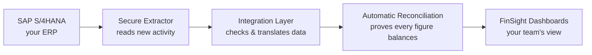
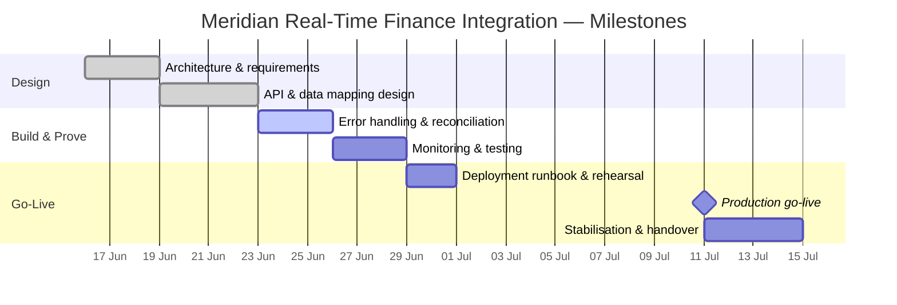

# Executive Summary — Real-Time Financial Visibility

**Prepared for:** Ananya Krishnan, Chief Financial Officer, Meridian Manufacturing Ltd.
**Prepared by:** Anutosh Mishra, Forward Deployed Engineer
**Project:** 493560B — Connecting SAP to the FinSight analytics platform
**Date:** 2026-07-07 · **Version:** v1.0

---

## The problem, and what we are doing about it

Today, your financial numbers reach the dashboards about **a day late**. Every night a batch
job copies data from SAP, so when you or the plant heads look at a report in the morning, you
are effectively looking at yesterday. That delay makes it harder to spot a cost overrun, a cash
issue, or a variance while there is still time to act — and it forces the finance team to pull and
stitch numbers together by hand.

We are building an automatic "bridge" between SAP (where every transaction is recorded) and
**Zetheta FinSight** (where you and your team view the analytics). Instead of one slow nightly
copy, the bridge sends new financial activity across continuously and safely, all day. Numbers
land in your dashboards within **4 hours** instead of 24 — and they cover all seven plants and
all three company codes automatically.

---

## The value — in numbers

| What improves | Before | After | Impact |
|---|---|---|---|
| **Data freshness** | 24 hours old | **≤ 4 hours** old | **83% fresher** information |
| **Finance-team effort** | Manual pulls & stitching | Automated flow | ~**120–160 hours/month** given back to the team |
| **Manual reconciliation** | Spreadsheet checks, error-prone | Automatic, every batch | Near-elimination of manual matching |
| **Coverage** | Selected reports | All 10 financial areas, all 3 company codes | Complete, consistent picture |
| **Accuracy of what you see** | Varies with manual effort | > 99.9% accuracy, every rupee reconciled | Board-grade confidence |

**In plain terms:** decisions get made on this-morning's reality instead of yesterday's, the
finance team stops doing repetitive data-wrangling, and every figure on the dashboard can be
traced back to its exact SAP entry for audit.

---

## How it works (at a glance)

Five steps, four handoffs: SAP → extract → translate & check → reconcile → dashboard.
Nothing is retyped by hand; the data is validated and balanced automatically along the way.

---

## Timeline to go-live

**Target go-live:** the 2nd-Saturday maintenance window, with a rehearsed, reversible
switch-over that keeps existing reports running throughout.

---

## Top 3 risks (in business terms)

| Risk | What it could mean | How we protect you |
|---|---|---|
| **1. Slowing down SAP** | If we pull data too aggressively, day-to-day SAP users could feel it | We stay within strict, agreed limits and never extract during the nightly close; SAP performance is monitored live |
| **2. A wrong or missing number** | A bad figure could mislead a decision | Every batch is automatically reconciled (debits must equal credits, source must equal target); anything that doesn't balance is quarantined and flagged, not shown |
| **3. Data leaving India / compliance** | Regulatory exposure on financial data | All processing stays inside India (AWS Mumbai); full audit trail from SAP entry to dashboard for your auditors |

Each risk has a tested response, and the whole go-live can be rolled back in **under 15 minutes**
if anything looks wrong — with no data loss.

---

## Investment & ROI

- **What it takes:** the integration platform (already designed and built as part of this
  engagement) plus a modest, India-based cloud footprint and the FinSight licences you
  already hold. No new SAP licences; no new hardware in your plants.
- **What you get back:** roughly **120–160 finance-team hours per month** returned to
  higher-value work, elimination of manual reconciliation effort, and faster, better decisions
  from data that is 83% fresher.
- **Payback:** the recovered team hours plus avoided manual-error rework are expected to
  cover the running cost well within the **first two to three quarters** of operation, after
  which the platform is a standing capability.

---

## The Ask

We are seeking three decisions from you:

1. **Approve go-live** in the upcoming 2nd-Saturday maintenance window.
2. **Confirm the operating budget** for the India-based cloud footprint and ongoing support
   (a small fraction of the team-hours value it returns).
3. **Nominate a finance super-user** to sign off the first week of live dashboards, so we
   confirm the numbers match your expectations before wider rollout.

With these approvals, Meridian moves from day-old finance reporting to a near-real-time,
fully reconciled, audit-ready view of the business across all seven plants.

*Prepared by Anutosh Mishra, Forward Deployed Engineer — available for a 30-minute walkthrough at your convenience.*
