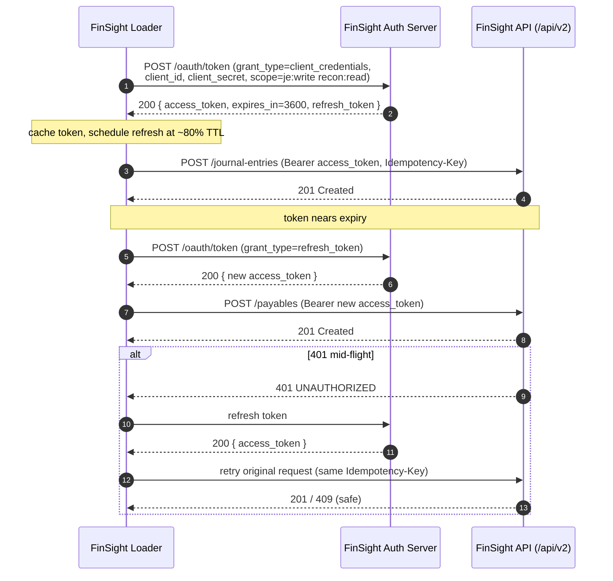

# Platform Engineering Design Review

| | |
|---|---|
| **Document** | `D9c_Platform_Engineering_Design_Review.md` |
| **Project** | 493560B — SAP S/4HANA → Zetheta FinSight integration |
| **Prepared for** | Marcus Wei, Zetheta Platform Engineer |
| **Prepared by** | Anutosh Mishra, Forward Deployed Engineer |
| **Version** | v1.0 · **Date** 2026-07-07 |
| **Scope** | How the integration consumes the FinSight `/api/v2/*` API, the throughput we drive, limitations we hit, and what we need from Platform Eng |

> **Context.** The integration loads reconciled financial data from Meridian's SAP S/4HANA
> into FinSight across **12 destination endpoints** (`DST-001…012`), routed by SAP company
> code (`MC01/02/03`) to tenants `MERIDIAN-MC01/02/03`. Writes are idempotent on the
> business key (`documentId`). All traffic stays in AWS `ap-south-1`.

**Contents**
1. API contract (with curl examples)
2. Authentication flow (OAuth 2.0)
3. Throughput expectations
4. Platform limitations encountered
5. Proposed changes
6. Engineering support requests

---

## Section 1 — API contract

### 1.1 Resources (versioned `/api/v2/`)

`/journal-entries`, `/payables`, `/receivables`, `/cost-centres`, `/profit-centres`,
`/material-ledger`, `/purchase-orders`, `/sales-orders`, `/fixed-assets`,
`/bank-statements`, `/budget-actuals`, `/inventory`.

### 1.2 Conventions the integration relies on

- **Method:** `POST` to create; upsert semantics via idempotency.
- **Idempotency:** every `POST` carries `Idempotency-Key: <documentId>`; a replay returns the
  original result (200/`409 Conflict`), never a duplicate record.
- **Tenancy:** `X-Tenant-Id: MERIDIAN-MC0{1|2|3}` (or body `tenantId`) drives routing.
- **Correlation:** `X-Correlation-Id` echoed back for end-to-end lineage (SAP doc → FinSight).
- **Pagination (reads):** cursor-based (`?cursor=…&limit=…`).
- **Rate-limit headers:** `X-RateLimit-Limit`, `X-RateLimit-Remaining`, `X-RateLimit-Reset`.

### 1.3 Example — create a journal entry

**Request**

```bash
curl -sS -X POST "https://api.finsight.internal/api/v2/journal-entries" \
  -H "Authorization: Bearer ${FINSIGHT_TOKEN}" \
  -H "Content-Type: application/json" \
  -H "X-Tenant-Id: MERIDIAN-MC01" \
  -H "Idempotency-Key: MC01-1900001234-2026" \
  -H "X-Correlation-Id: 7f3a-gl-2026-07-07T12:00Z" \
  -d '{
    "documentId": "MC01-1900001234-2026",
    "companyCode": "MC01",
    "tenantId": "MERIDIAN-MC01",
    "fiscalYear": 2026,
    "fiscalPeriod": "004",
    "postingDate": "2026-07-05",
    "documentType": "SA",
    "currency": "INR",
    "lines": [
      {"lineId": 1, "glAccount": "0000400000", "debitCredit": "D", "amount": 150000.00, "profitCentre": "PC-PUNE-01", "costCentre": "CC-PUNE-PROD"},
      {"lineId": 2, "glAccount": "0000113100", "debitCredit": "C", "amount": 150000.00, "profitCentre": "PC-PUNE-01", "costCentre": "CC-PUNE-PROD"}
    ],
    "tax": {"cgst": 0, "sgst": 0, "igst": 0},
    "sourceRef": {"sapDocNo": "1900001234", "sapCompanyCode": "MC01", "sapFiscalYear": 2026}
  }'
```

**Response — 201 Created**

```json
{
  "id": "je_01HZY9MC01",
  "documentId": "MC01-1900001234-2026",
  "tenantId": "MERIDIAN-MC01",
  "status": "ACCEPTED",
  "receivedAt": "2026-07-07T12:00:01Z",
  "correlationId": "7f3a-gl-2026-07-07T12:00Z"
}
```

**Response — 409 Conflict (idempotent replay)**

```json
{ "error": "DUPLICATE", "documentId": "MC01-1900001234-2026", "existingId": "je_01HZY9MC01" }
```

### 1.4 Example — read-back for reconciliation

```bash
curl -sS "https://api.finsight.internal/api/v2/journal-entries?tenant=MERIDIAN-MC01&postingDate=2026-07-05&limit=100&cursor=" \
  -H "Authorization: Bearer ${FINSIGHT_TOKEN}"
```

### 1.5 Error contract we consume (per Appendix B)

| HTTP | Code | Our handling |
|---|---|---|
| 400 | `INVALID_REQUEST` | Log specifics, route to DLQ, no retry |
| 400 | `INVALID_DATE_FORMAT` | Normalise to ISO 8601, retry once, else DLQ |
| 400 | `INVALID_CURRENCY_CODE` | Apply ISO 4217 mapping fix, else DLQ |
| 401 | `UNAUTHORIZED` | Refresh token, retry once |
| 409 | `DUPLICATE` | Treat as success (idempotent) |
| 429 | `RATE_LIMITED` | Honour `Retry-After`/`X-RateLimit-Reset`, backoff |
| 5xx | `SERVER_ERROR` | Exponential backoff w/ jitter, circuit breaker |

Backoff formula (shared with D4): `wait = min(cap, random(base, base * 2^attempt))`.

---

## Section 2 — Authentication flow

FinSight auth is **OAuth 2.0 `client_credentials`** with refresh; client `finsight-integ-loader`,
scoped per resource. Tokens are cached and proactively refreshed before expiry.



### 2.1 Token lifecycle & scopes

| Item | Value |
|---|---|
| Grant | `client_credentials` (+ `refresh_token`) |
| Access-token TTL | 3600 s; refreshed at ~80% TTL |
| Client | `finsight-integ-loader` (secret in Vault, India region) |
| Scopes (per endpoint) | `je:write`, `ap:write`, `ar:write`, `cc:write`, `pc:write`, `ml:write`, `po:write`, `so:write`, `fa:write`, `bank:write`, `budget:write`, `inv:write`, `recon:read` |
| Transport | TLS 1.2+; token never logged (redacted in ELK) |

---

## Section 3 — Throughput expectations

Baseline volume ≈ **2.1M financial transactions/month** across 3 company codes. The table
below is what the Loader will drive per endpoint. "Records/min" is post-transformation write
rate to FinSight; peaks reflect the 30-min ODP delta bursts and festival-season 5x scenarios.

| Endpoint | Domain | Avg records/min | Peak records/min | Typical batch size | Cadence |
|---|---|---|---|---|---|
| `DST-001` | Journal Entries (GL) | ~500 | ~2,500 | 200–500 | 30 min delta |
| `DST-002` | Payables (AP) | ~150 | ~800 | 200 | 30 min delta |
| `DST-003` | Receivables (AR) | ~150 | ~800 | 200 | 30 min delta |
| `DST-004` | Cost Centres | ~20 | ~100 | 100 | 4 h batch |
| `DST-005` | Profit Centres | ~10 | ~60 | 100 | 4 h batch |
| `DST-006` | Material Ledger | ~120 | ~600 | 200 | 60 min delta |
| `DST-007` | Purchase Orders | ~100 | ~500 | 200 | 30 min delta |
| `DST-008` | Sales Orders | ~80 | ~400 | 200 | 30 min delta |
| `DST-009` | Fixed Assets | ~15 | ~80 | 100 | daily batch |
| `DST-010` | Bank Statements | event | ~200 (burst) | per statement | event (IDoc) |
| `DST-011` | Budget/Actuals | ~30 | ~150 | 200 | daily batch |
| `DST-012` | Inventory | ~120 | ~600 | 200 | 60 min delta |
| **Aggregate** | all | **~1,300 rec/min** | **~7,000 rec/min** | — | — |

- **Peak vs average:** peaks are short (delta-window bursts). We smooth them with Kafka
  buffering and bounded batch sizes so we do not spike FinSight.
- **Bandwidth ceiling:** writes are shaped to stay within **≤ 25% of 450 Mbps** in business
  hours; heavier catch-up runs off-hours.
- **Freshness target:** end-to-end **≤ 4 h** (well under, given 30-min cadence) — the headline
  SLA.
- **Ordering:** partitioned by company code (Kafka), so per-tenant ordering is preserved.

---

## Section 4 — Platform limitations encountered

| # | Limitation | Impact on us | Current workaround |
|---|---|---|---|
| L1 | **No bulk/batch POST** on `/api/v2/*` (one record per request) | At ~7,000 rec/min peak this is a lot of round-trips; connection & TLS overhead | Connection pooling + HTTP keep-alive + parallel workers within rate limit |
| L2 | **Rate limits per client, not per tenant** | A GL burst on `MC01` can starve `MC02/03` throughput | Weighted fair-queue in Loader across tenants; still hits the shared ceiling at peak |
| L3 | **429 lacks a granular `Retry-After`** in some responses | Backoff is coarser than ideal, adds latency to recovery | Fall back to `X-RateLimit-Reset`; exponential backoff w/ jitter |
| L4 | **Idempotency window / retention unclear** | Need certainty that a replay hours later still de-dupes | Assuming ≥ 72 h dedupe; needs confirmation (see §6) |
| L5 | **No schema-version header** on responses | Hard to detect a breaking schema change proactively | Contract lint (Spectral) in CI + drift monitor; reactive, not proactive |
| L6 | **GST breakdown fields optional in schema** | Risk of losing CGST/SGST/IGST on invoice transforms (compliance) | We always send the `tax` object; would prefer schema to make it required for invoice types |
| L7 | **Read-back pagination cap** (`limit` max 100) | Reconciliation read-backs need many pages for large days | Cursor loop; higher cap would cut recon time |

None are blockers — all have workarounds — but L1, L2, L4 and L6 materially affect efficiency
and compliance confidence at scale.

---

## Section 5 — Proposed changes

Prioritised requests to the FinSight API (P1 = highest value):

| # | Priority | Proposal | Benefit |
|---|---|---|---|
| P1 | High | **Bulk endpoint** `POST /api/v2/{resource}:batch` (array + per-item idempotency key, 207 multi-status) | Cuts request count ~100–200×, lowers latency and cost at peak; directly helps L1 |
| P2 | High | **Per-tenant rate-limit dimension** (limit keyed on `X-Tenant-Id`) | Fair throughput across `MC01/02/03`; addresses L2 |
| P3 | High | **Make GST fields required for invoice-bearing document types** in schema | Enforces CGST/SGST/IGST retention for RBI/GST compliance; addresses L6 |
| P4 | Medium | **`Retry-After` on every 429** + documented idempotency retention window (≥ 72 h) | Faster, safer recovery; addresses L3, L4 |
| P5 | Medium | **`X-Schema-Version` response header** + changelog webhook | Proactive breaking-change detection; addresses L5 |
| P6 | Low | **Raise read pagination cap** to 500 (or add a bulk export for recon) | Faster reconciliation read-backs; addresses L7 |
| P7 | Low | **Webhook callbacks** on async accept/reject | Lets us drop some polling; lowers request volume |

All proposals are **additive / backward-compatible** and fit the existing `/api/v2/` versioning —
no breaking change requested.

---

## Section 6 — Engineering support requests

Specific items needing Platform Eng action, with owner **Marcus Wei**:

1. **Confirm idempotency retention window** for `Idempotency-Key` (we assume ≥ 72 h). Blocks
   our replay-safety guarantee on delayed retries. *(Needed before go-live.)*
2. **Provision the OAuth client** `finsight-integ-loader` with the 13 scopes in §2.1 and share
   the client secret via the agreed Vault path (India region). *(Blocks connectivity.)*
3. **Confirm/raise rate limits** for our client to sustain ~7,000 rec/min peak aggregate within
   the bandwidth ceiling, and share the exact `X-RateLimit-Limit` per resource.
4. **Provide a non-prod (sandbox) tenant** mirroring `MERIDIAN-MC01/02/03` for our
   pre-cutover shadow validation (D8 Step 4).
5. **Agree the API contract freeze** for go-live and a change-notification path (email + the
   proposed schema-version webhook, P5) so we are never surprised by a schema change.
6. **Review proposals P1–P3** (bulk endpoint, per-tenant rate limits, required GST fields) for
   roadmap placement; P3 is a compliance dependency for Meridian.
7. **Confirm read pagination limits and cursor stability** so reconciliation read-backs are
   deterministic across a large posting day.

**Requested timeline:** items 1–4 before the go-live window (2nd-Saturday); items 5–7 within
the first stabilisation sprint post-go-live.

---

*Prepared by Anutosh Mishra, Forward Deployed Engineer. Happy to walk the schemas and curl
examples live with the platform team.*

*End of D9c — Platform Engineering Design Review v1.0.*
